# 短链接管理系统
### 生成短链


### 修改短链
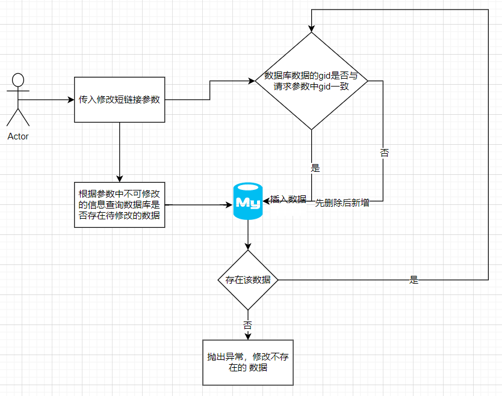
### 短链跳转
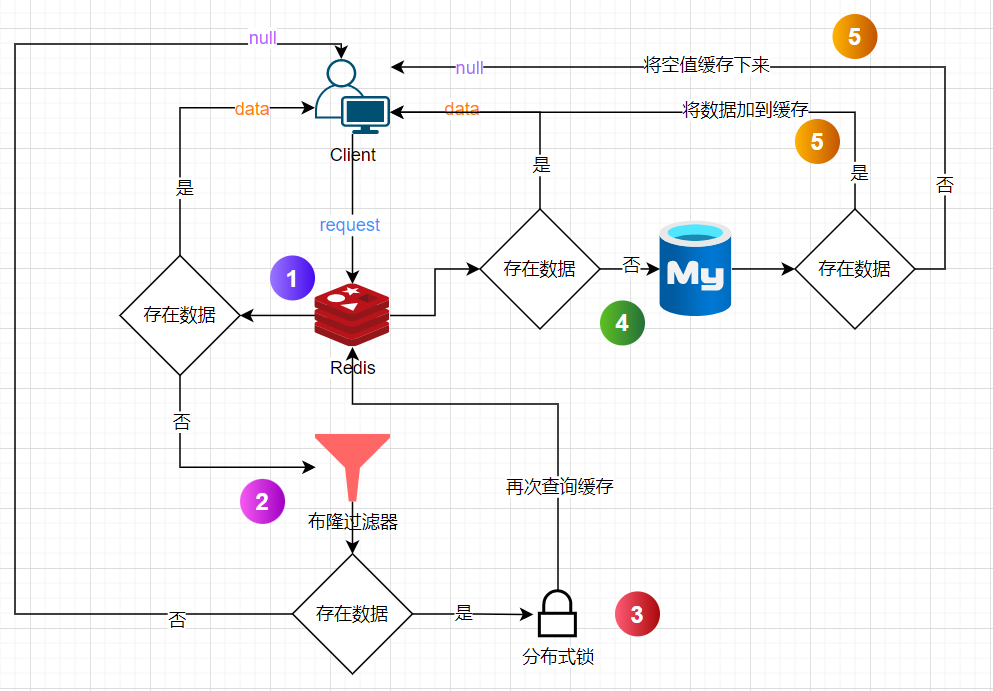
### 服务调用
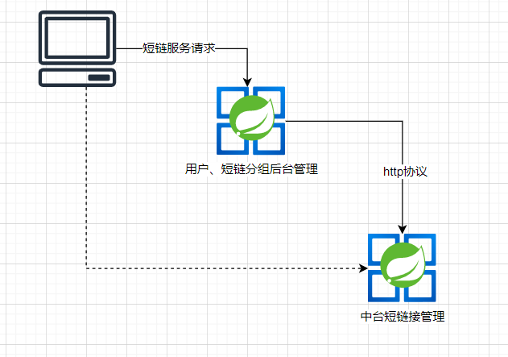
## 核心服务接口演示
### 用户后管
- 注册
- 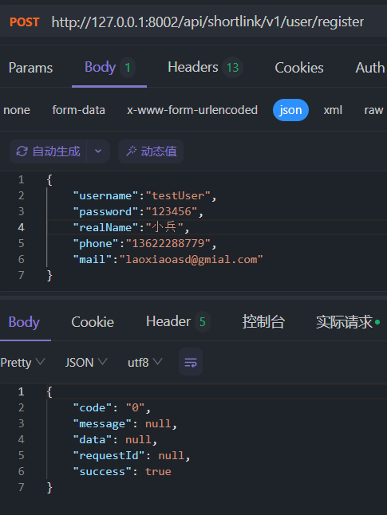
- 登录
- 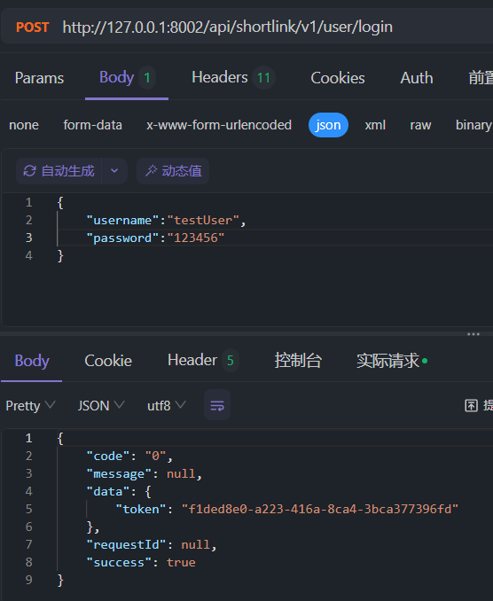
- 用户信息获取
- 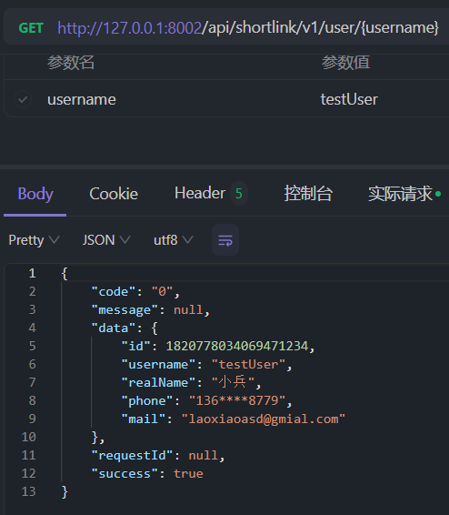
### 短链中台
- 用户创建的短链分组查询
- 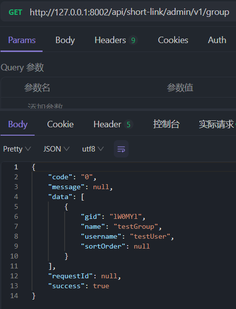
- 创建短链
- 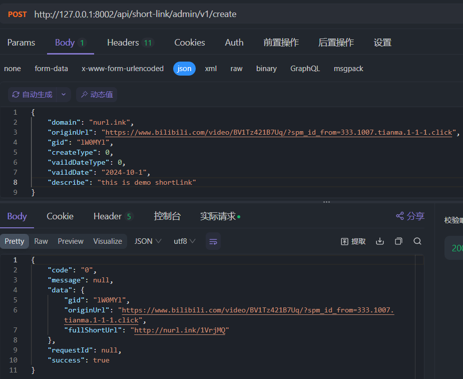
- 查询分组下短链
- 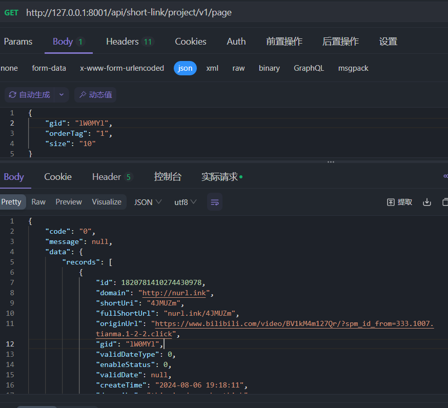
- 短链跳转
- 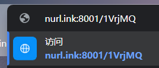
- 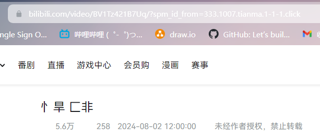
## 项目技术回顾 🚀

### 🌱 Spring-boot项目的创建和配置过程

- **依赖** 📦
    - 父依赖`spring-boot-starter-web`规约版本号
    - 子模块依赖：无需声明版本，继承父依赖

- **配置** ⚙️
    - 端口号配置
    - 数据源配置
    - 分表配置

### 📄 ApiFox接口文档使用

- **运行环境管理** 🌐
    - 服务URL
    - 全局环境变量

- **接口文档声明** 📜

- **调试接口** 🛠️

### 💻 编码API的过程

- **Dao持久层实体声明** 🗂️
    - `entity`
    - `mapper`
    - 部分字段自动填充功能`Mybatis-plus`
        - `Handle`类 继承`MetaObjectHandler`接口，重写`insertFill`和`updateFill`方法
        - 注解标识实体字段`@TableField(fill = FieldFill.INSERT_UPDATE)`

- **DTO数据传输对象声明** 📤
    - `req`
    - `resp`

- **Controller控制层** 🎛️
- **Service服务层** 🛠️
    - `service interface`
    - `service impl`

- **Filter** 🌐
    - 实现过滤器逻辑
        - 继承`Filter`接口
        - 重写`doFilter`逻辑
            - 放行接口 -> 后续使用网关，可忽略
            - 验证登录
        - 调用`filterChain.doFilter()`放行
    - 配置Filter
        - 注册过滤器
        - 过滤规则
        - 执行顺序

### 🌐 全局设置

- **全局错误响应码设计`errorcode`** 🛑
    - `IErrorCode`接口
    - 实现类

- **全局异常设计`exception`** ⚠️
    - 抽象异常 -> 封装响应码和响应信息
    - 客户端异常
    - 服务端异常
    - 远程调用服务异常

- **全局返回对象设计`result`** 📊
    - `Result`
        - `code`
        - `message`
        - `data` -> `dto`
        - `requestId`
        - `success`
    - `Results` 构造者模式 模板方法

### 🔒 敏感信息脱敏

- JSON序列化返回脱敏
- 敏感信息加密存储 `ShardingSphere`

### 🛡️ 布隆过滤器应用——穿透场景

- 依赖引入
- 配置Redis
- 配置类
    - 元素个数
    - 误判率

### ⚙️ ShardingSphere分表

- 引依赖
- 配置
    - `application.yaml`配置`ShardingSphere`数据源
    - `shardingsphere-config.yaml`配置
        - 分片键
        - 分片算法

- DDL分表

### 👤 用户上下文——阿里巴巴TTL

```sql
// 阿里巴巴开源的TTL 线程安全的ThreadLocal 能够实现没有任何关系的类间跨线程的传递
// 意味着即便在多线程的情况下也能获取到线程信息
private static final ThreadLocal<UserInfoDTO> USER_THREAD_LOCAL = new TransmittableThreadLocal<>();

```
### 📊 分页功能——Mybatis-Plus
- 配置分页插件
- 声明分页查询Param类 -> 继承Page<Object>

### 微服务改造——SpringCloudAlibaba
- Nacos 服务注册配置 服务发现
- Nginx 网关 负载均衡 限流熔断 统一 API 管理

出于**交流学习**目的，非商业用途，侵删
参考资料
https://nageoffer.com/shortlink/#%E9%A1%B9%E7%9B%AE%E6%8F%8F%E8%BF%B0
https://baomidou.com/introduce/
https://shardingsphere.apache.org/document/current/cn/overview/