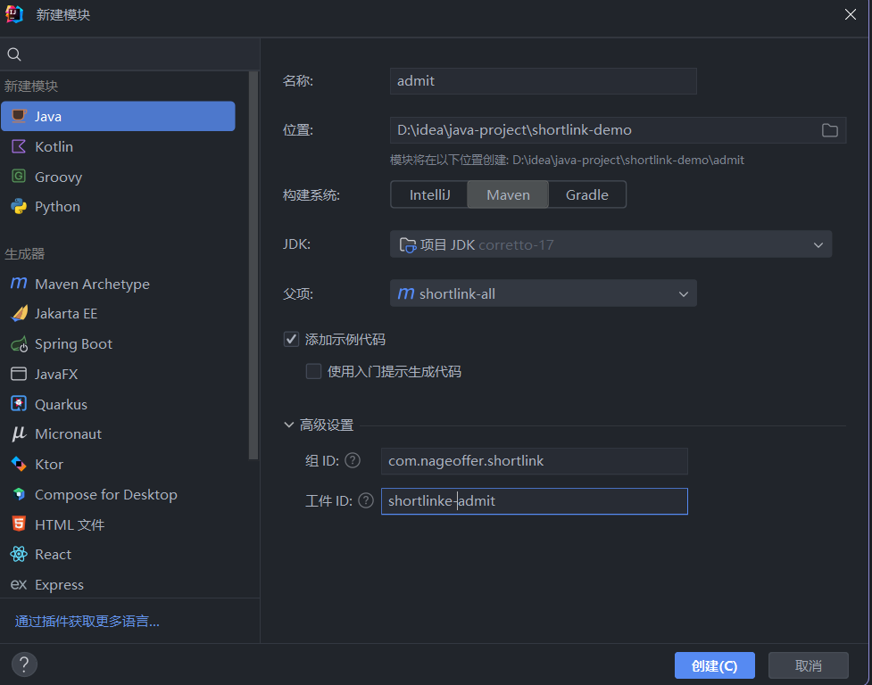
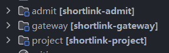
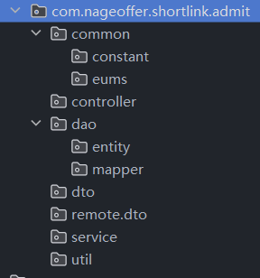
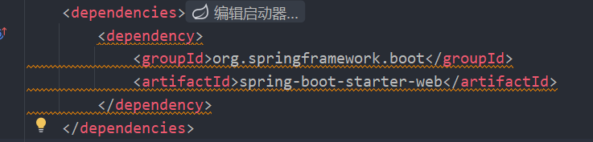
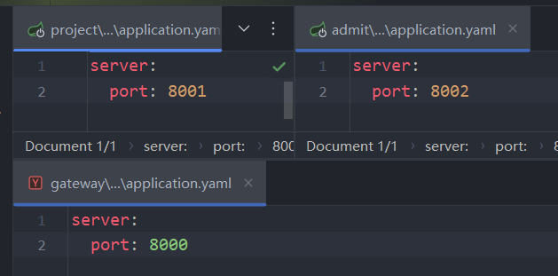
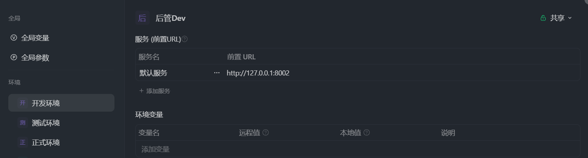
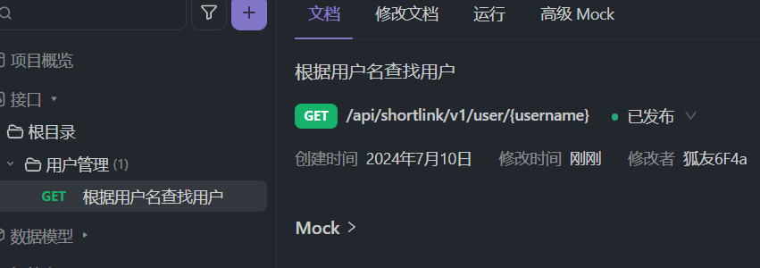
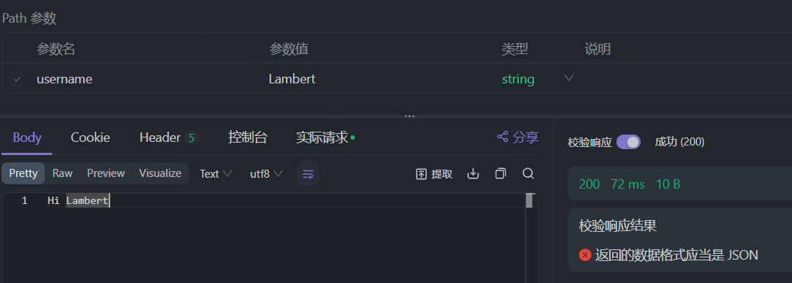
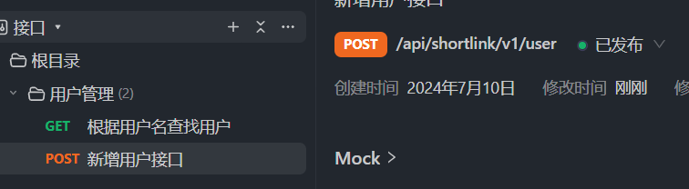

# 开发日志-24-7-10
- 配置pom.xml文件 
- 创建相应的子模块


  - admit:后台管理
  - gateway:网关
  - project:短链接中台
- 后台管理开发包目录

- 搭建Spring-boot-web启动类
  - 添加Springboot依赖!

  - 分别配置网络端口
    - gateway 8000
    - project 8001 
    - admit 8002

  - 为admit后台添加Springboot启动类

```java
@SpringBootApplication
public class ShortLinkAdminApplication {
  public static void main(String[] args) {
    SpringApplication.run(ShortLinkAdminApplication.class, args);
  }
}

```
- apiFox创建接口文档
  - 配置api的环境 后管是8002端口

  - 创建第一个api

  - 在controller中将user相应的查询接口写出来
```java
/**
 * 用户管理控制层
 * RestController相当于是ResponseBody和Controller的结合
 */
@RestController
public class UserController {
    /**
     * 根据用户名查询用户信息
     */
    @GetMapping("/api/shortlink/v1/user/{username}")
    public String getUserByUsername(@PathVariable("username")String username){
        return "Hi " + username;
    }
}

```
  - 通过apifox对接口进行测试 测试成功
    - @RestController:用来标识一个Controller
    - @GetMapping:用来标识一个接口，括号内是接口的路径
    - @PathVariable:用来标识接口需要接收的参数，括号内是Restful变量名



  - 再声明一个新增用户的接口

