# 开发日志-24-7-11
### 用户模块
#### 功能设计
- 检查用户是否存在
- 注册用户
- 修改用户
- 根据用户名修改用户
- 用户登录
- 检查用户是否登录
- 用户退出登录
- 注销用户
## 用户持久层设计
### 用户表设计
```azure
create table t_user
(
    id            bigint auto_increment comment 'ID'
        primary key,
    username      varchar(256) null comment '用户名',
    password      varchar(512) null comment '密码',
    real_name     varchar(256) null comment '真实姓名',
    phone         varchar(128) null comment '手机号',
    mail          varchar(512) null comment '邮箱',
    deletion_time bigint       null comment '注销时间',
    create_time   datetime     null comment '创建时间',
    update_time   datetime     null comment '修改时间',
    del_flag      tinyint(1)   null comment '删除标识 '
);

```
### 用户实体类创建entity
可以根据表的信息将实体用户创建出来，这里不需要手敲代码 有根据表信息快捷生成代码的网站
```java
@TableName("t_user")
public class UserDo {
    
}
```
### 引入持久层的依赖和配置文件
https://www.yuque.com/magestack/shortlink/mgfmhmtupkl3im8w
并在启动类添加持久层映射的扫描
```java
@SpringBootApplication
@MapperScan("com.nageoffer.shortlink.admin.dao.mapper")
public class ShortLinkAdminApplication {
    public static void main(String[] args) {
        SpringApplication.run(ShortLinkAdminApplication.class, args);
    }
}
```
### 创建持久层接口Mapper
这里使用了MybatisPlus 需要继承BaseMapper接口
```java
/**
 * 用户持久层
 */
public interface UserMapper extends BaseMapper<UserDo> {
    
}
```
## 用户服务层设计
### 创建用户接口
```java
/**
 * 用户接口层
 */
public interface UserService extends IService<UserDo> {
    
}

```
### 创建用户实现类
```java
/**
 * 用户接口实现层
 */
@Service
public class UserServiceImpl extends ServiceImpl<UserMapper, UserDo> implements UserService {

}

```
### 定义服务传输实体DTO
包结构

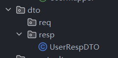

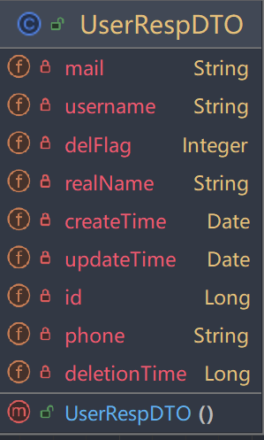

### Service设计接口方法和实现
控制器返回Response实体
```java
public UserRespDTO getUserByUsername(String username) {
    LambdaQueryWrapper<UserDo> queryWrapper = Wrappers.lambdaQuery(UserDo.class)
            .eq(UserDo::getUsername, username);
    UserDo userDo = baseMapper.selectOne(queryWrapper);
    UserRespDTO result = new UserRespDTO();
    BeanUtils.copyProperties(userDo, result);
    return result;
}
```
请求接口后成功返回UserRespDo相关信息

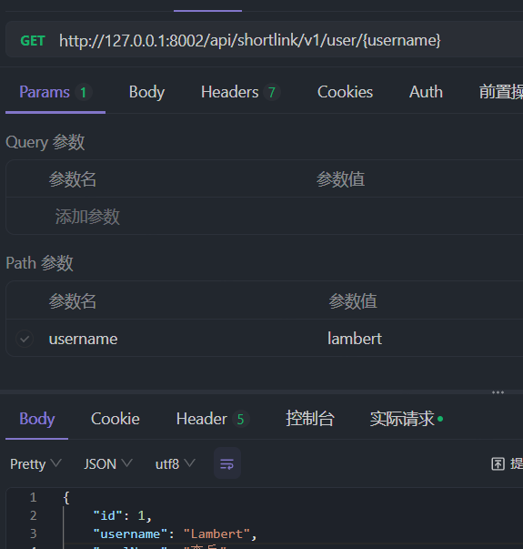

## 全局实体信息设计
Why? 在生产环境中的response Json通常是由下面最基本的四部分组成
```json
{
  "code": "200",
  "message": "success",
  "data":
  {
    "userId": "01",
    "username": "Lambert"
  },
  "success": false
}
```
用以标识当前对接口的请求结果，是成功？异常？
- code：状态码
- message：状态码详细信息
- data：本次请求返回的数据
- success：请求是否成功

这样的实现其实是对HTTP状态码的扩展，能够反映接口运行的情况

包路径/common/convention/result

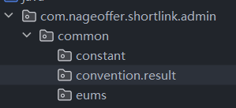

全局统一返回实体
```java
package com.nageoffer.shortlink.admin.common.convention.result;

import lombok.Data;
import lombok.experimental.Accessors;

import java.io.Serial;
import java.io.Serializable;

/**
 * 全局返回对象
 */
@Data
@Accessors(chain = true)
public class Result<T> implements Serializable {

    @Serial
    private static final long serialVersionUID = 5679018624309023727L;

    /**
     * 正确返回码
     */
    public static final String SUCCESS_CODE = "0";

    /**
     * 返回码
     */
    private String code;

    /**
     * 返回消息
     */
    private String message;

    /**
     * 响应数据
     */
    private T data;

    /**
     * 请求ID
     */
    private String requestId;

    public boolean isSuccess() {
        return SUCCESS_CODE.equals(code);
    }
}
```

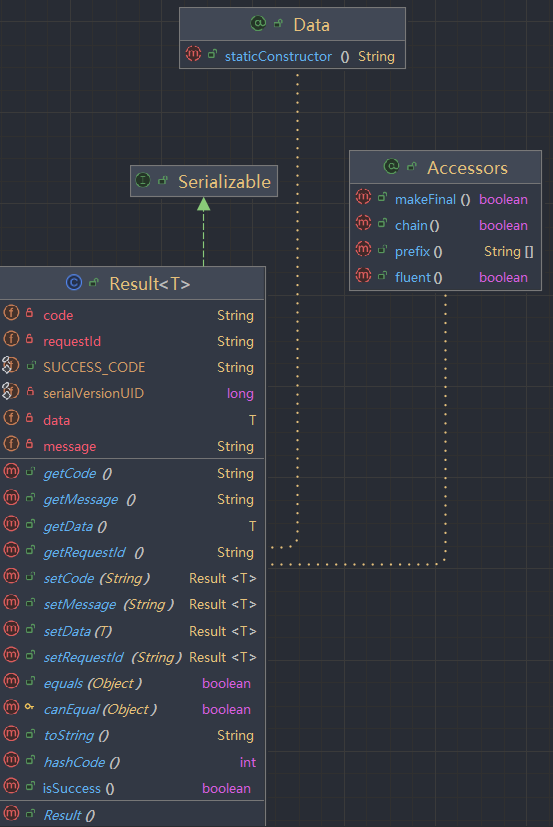

有了这个全局统一的返回实体，我们可以在Controller将返回的实体类修改为Result<Class>
```java
/**
 * 根据用户名查询用户信息
 */
@GetMapping("/api/shortlink/v1/user/{username}")
public Result<UserRespDTO> getUserByUsername(@PathVariable("username")String username){
    UserRespDTO result = userService.getUserByUsername(username);
    if(result == null){
        return new Result<UserRespDTO>()
                .setCode("-1")
                .setMessage("不存在该用户");
    }else {
        return new Result<UserRespDTO>()
                .setCode("0")
                .setData(result);
    }
}
```
这里我们可以进一步去优化代码，使用Results类来链式地创建Result，进一步去简化代码

部分代码实现如下，可以看出Results类是对Result进行进一步封装，这样实现的好处是可以在异常拦截器的实现中保证代码的简洁
```java
/**
 * 全局返回对象构造器，这里使用链式的方案，这里需要依赖Result这个类
 */
public final class Results {

    /**
     * 构造成功响应
     */
    public static Result<Void> success() {
        return new Result<Void>()
                .setCode(Result.SUCCESS_CODE);
    }

    /**
     * 构造带返回数据的成功响应
     */
    public static <T> Result<T> success(T data) {
        return new Result<T>()
                .setCode(Result.SUCCESS_CODE)
                .setData(data);
    }

    /**
     * 构建服务端失败响应
     */
    public static Result<Void> failure() {
        return new Result<Void>()
                .setCode(BaseErrorCode.SERVICE_ERROR.code())
                .setMessage(BaseErrorCode.SERVICE_ERROR.message());
    }
}
```


向接口发起请求
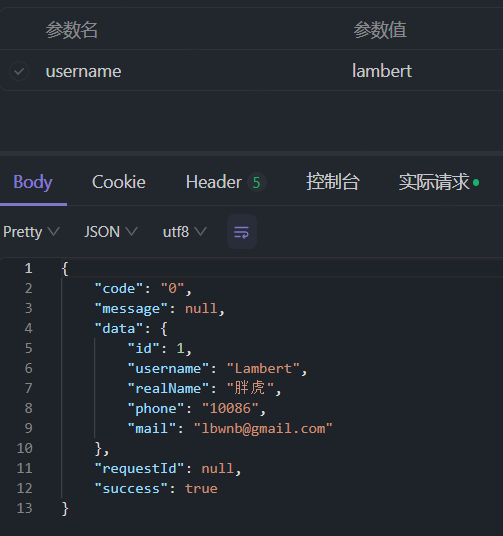

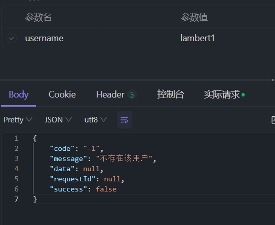

#### 缺点
- 每一次返回Json信息都要创建全局返回实体Result对象，需要频繁地进行查询信息的封装
- 在Controller部分有较多的业务代码，在这里出现了判断的逻辑，不符合开发规范

#### 解决思路
在`ServiceImp`，也就是服务的实现逻辑中抛异常 并实现全局异常拦截器，进而达到在全局将异常信息封装起来
- 前置知识
  - 异常码的设计
  - 异常的设计
  - 全局异常拦截器

### 异常码设计
参考阿里巴巴开发手册中的规范

- `1）错误码为字符串类型，共 5 位，分成两个部分：错误产生来源+四位数字编号。
说明：错误产生来源分为 A/B/C。A 表示错误来源于用户，比如参数错误，用户安装版本过低，用户支付
超时等问题；B 表示错误来源于当前系统，往往是业务逻辑出错，或程序健壮性差等问题；C 表示错误来源
于第三方服务，比如 CDN 服务出错，消息投递超时等问题。四位数字编号从 0001 到 9999，大类之间的步长间距预留 100。
`
- `2）编号不与公司业务架构，更不与组织架构挂钩，一切与平台先到先申请的原则进行，审批生效，编号即被永久固定。`
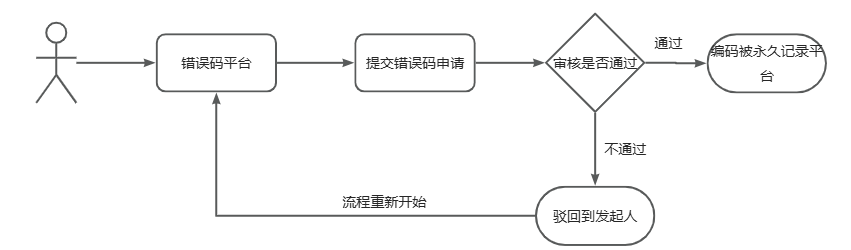

异常码分类：
- 一级宏观错误码、
- 二级宏观错误码（二级宏观错误码间步长为100）、
- 三级详细错误码（二级下的详细错误码）。

声明错误码接口

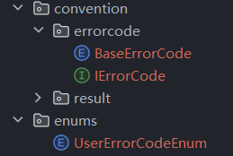

自定义用户请求错误的相应枚举,如果添加自定义枚举 在其下面声明一条枚举即可，在其他部分的逻辑实现异常码的复用，在排查问题时也能快速地定位
```java
// 用户系统二级宏观错误
public enum UserErrorCodeEnum implements IErrorCode {

    USER_NULL("B000200","用户记录不存在");

    private final String code;

    private final String message;

    UserErrorCodeEnum(String code, String message) {
        this.code = code;
        this.message = message;
    }

    @Override
    public String code() {
        return code;
    }

    @Override
    public String message() {
        return message;
    }
}

```
这样我们Controller中的代码可进一步封装
```java
/**
 * 根据用户名查询用户信息
 */
@GetMapping("/api/shortlink/v1/user/{username}")
public Result<UserRespDTO> getUserByUsername(@PathVariable("username") String username) {

  // 获取到UserRespDTO实体
  UserRespDTO result = userService.getUserByUsername(username);

  // 根据查询的情况返回相应的json
  if (result == null) {
    return new Result<UserRespDTO>()
            .setCode(UserErrorCodeEnum.USER_NULL.code())
            .setMessage(UserErrorCodeEnum.USER_NULL.message());
  } else {
    return Results.success(result);
  }
}
```
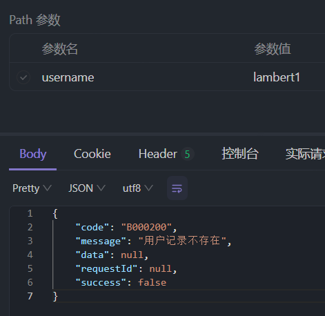

## 全局异常拦截器

在业务场景中，如果出现了异常，通常来说是类似于RuntimeException这种，没有办法去进一步定位是什么异常，进而无法去向前端响应对应的状态码

抽象异常体系
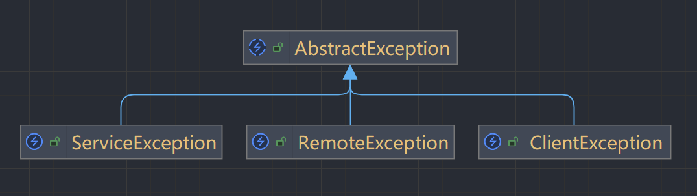
这样我们就可以直接修改service层的代码，直接抛出一个自定义的客户端异常
```java
// 如果数据库中没有找到该对象
if(userDo == null){
    throw new ClientException(UserErrorCodeEnum.USER_NULL);
}
```

拦截器声明


需要引入依赖
```
<dependency>
      <groupId>cn.hutool</groupId>
      <artifactId>hutool-all</artifactId>
</dependency>
```
之后就可以使用捕获器来捕获全局的异常

在Controller中 如果没有查询到用户 抛出异常

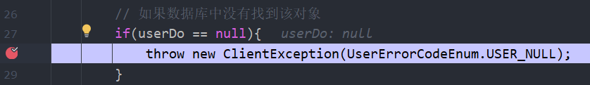

被拦截器拦截到异常

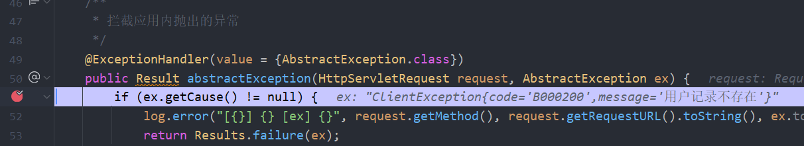

返回给前端

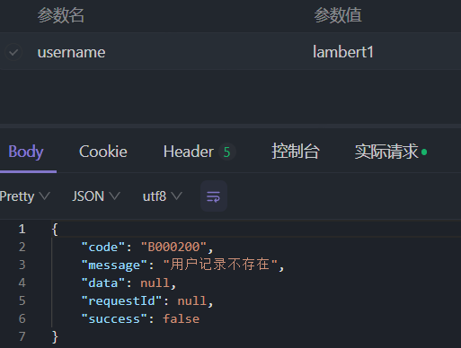