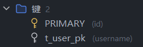

# 开发日志-24-7-11
### 用户敏感信息脱敏
常见的手机号、身份证号、家庭住址等敏感信息应当在脱敏后返回前端，保障内容安全。

哪里会暴露敏感信息


在controller返回给前端的Result<UserRespDTO>中有`phone`字段，这里暴露了敏感信息

#### 解决的思路
- 自定义注解，通过Aop的方式去定位到你的敏感信息，然后对应地去做一个透明展示。但是实现过于复杂
- 通过Json默认序列化的方式（Springboot将实体对象序列化通过Jackson框架转换为Json），返回脱敏后的信息。

在common/serialize软件包中新建序列化器


```java
/**
 * 手机号脱敏反序列化
 */
public class PhoneDesensitizationSerializer extends JsonSerializer<String> {

    @Override
    public void serialize(String phone, JsonGenerator jsonGenerator, SerializerProvider serializerProvider) throws IOException {
        String phoneDesensitization = DesensitizedUtil.mobilePhone(phone);
        jsonGenerator.writeString(phoneDesensitization);
    }
}
```
只需要在对应的敏感字段中标注注解即可脱敏，不需要改动特别多的代码

```java
/**
 * 手机号
 */
@JsonSerialize(using = PhoneDesensitizationSerializer.class)
private String phone;
```

调试序列化结果


#### 返回未脱敏的数据
- 声明UserActualRespDTO，也就是UserRespDTO去掉脱敏的注解
- controller中创建一个新的接口`/api/shortlink/v1/actual/user/{username}`，进行UserRespDTO到UserActualRespDTO的转换
- `BeanUtil.toBean` 是一个用于将一个对象转换为另一个类型的对象的方法。在 Java 中，BeanUtil 通常是一个工具类，用于处理 Bean（JavaBean 对象）之间的转换。


### 检查用户名是否存在功能实现
在注册过程中，为了用户的使用体验，通常会提供一个api接口去查看用户当前输入的用户名是否已经被注册

/service/UserService
```java
/**
     * 查询用户名是否存在
     * @param username
     * @return
     */
    Boolean hasUsername(String username);
```
/service/impl/UserServiceImpl
```java
@Override
    public Boolean hasUsername(String username) {
        LambdaQueryWrapper<UserDo> queryWrapper = Wrappers.lambdaQuery(UserDo.class)
                .eq(UserDo::getUsername, username);
        UserDo userDo = baseMapper.selectOne(queryWrapper);
        return userDo != null;
    }
```
/controller/UserController
```java
/**
     * 根据用户名查询是否存在
     * @param username
     * @return
     */
    @GetMapping("/api/shortlink/v1/has-username/user/{username}")
    public Result<Boolean> hasUserName(@PathVariable("username") String username){
        return Results.success(userService.hasUsername(username));
    }
```

测试接口


### 防止检查用户名缓存穿透
#### 存在问题
并发的业务场景下，海量的用户名查询请求都会打到数据库中，数据库压力较大
#### 解决思路
- 中间件缓存数据
  - 如何设置数据有效？       -> 非常热点的数据永不过期
  - 如何解决不存在的请求     -> 布隆过滤器、暂存空数据
#### 缓存应用
- 依赖引入
```
<dependency>
    <groupId>org.springframework.boot</groupId>
    <artifactId>spring-boot-starter-data-redis</artifactId>
</dependency>

<dependency>
    <groupId>org.redisson</groupId>
    <artifactId>redisson-spring-boot-starter</artifactId>
</dependency>
```
- 修改Redis相关配置
```
spring:
    data:
      redis:
        host: 127.0.0.1
        port: 6379
```
- 配置布隆过滤器 包目录/common/config/RBloomFilterConfiguration
```java
import org.redisson.api.RBloomFilter;
import org.redisson.api.RedissonClient;
import org.springframework.context.annotation.Bean;
import org.springframework.context.annotation.Configuration;

/**
 * 布隆过滤器配置
 */
@Configuration
public class RBloomFilterConfiguration {

  /**
   * 防止用户注册查询数据库的布隆过滤器
   */
  @Bean
  public RBloomFilter<String> userRegisterCachePenetrationBloomFilter(RedissonClient redissonClient) {
    RBloomFilter<String> cachePenetrationBloomFilter = redissonClient.getBloomFilter("userRegisterCachePenetrationBloomFilter");
    cachePenetrationBloomFilter.tryInit(100000000L, 0.001);
    return cachePenetrationBloomFilter;
  }
}
```
- `cachePenetrationBloomFilter.tryInit(0, 0)`核心参数
  - expectedInsertions:预计加入的元素
  - falseProbability:误判率
#### 修改服务层的实现
```java
/**
 * 用户接口实现层
 */
@Service
@RequiredArgsConstructor
public class UserServiceImpl extends ServiceImpl<UserMapper, UserDo> implements UserService {
    
    // 非法用户名拦截布隆过滤器
    private final RBloomFilter<String> userRegisterCachePenetrationBloomFilter;
    
    @Override
    public Boolean hasUsername(String username) {
        return userRegisterCachePenetrationBloomFilter.contains(username);
    }
}

```
当前的布隆过滤器还没有元素，等到后面开发了注册的业务后，每注册一个用户就将用户名放到布隆过滤器里。
#### 使用布隆过滤器的场景
- 设计层面：在设计之初考虑到可能出现的缓存穿透的场景，在新增数据的过程中将数据存到布隆过滤器里，不需要容器存储数据。
- 中后期引入：中后期随着业务需求和用户体量的增长，加入布隆过滤器组件，每次读取数据时将目标刷入到布隆过滤器。
### 实现海量请求注册功能
#### 用户注册功能实现
- 接口设计


- 用户注册请求实体类


- 注册接口声明和实现service/UserService | service/impl/UserServiceImpl
```java
/**
 * 注册接口
 * @param requestParam
 */
void Register(UserRegisterReqDTO requestParam);
```
```java
@Override
@Override
public void Register(UserRegisterReqDTO requestParam) {
  // 如果用户名存在 抛出异常 这里使用了布隆过滤器进行了隔离
  if(hasUsername(requestParam.getUsername())){
    throw new ClientException(UserErrorCodeEnum.USER_NAME_EXIST);
  }
  // 如果插入数据库的数据小于1，说明注册失败，已经有这条用户数据，也抛出异常
  int insert = baseMapper.insert(BeanUtil.toBean(requestParam, UserDo.class));
  if(insert < 1){
    throw new ClientException(UserErrorCodeEnum.USER_EXIST);
  }
}
```
- 响应码声明
```
USER_NAME_EXIST("B000201","用户名已存在"),
USER_SAVE_ERROR("B000202","用户记录已存在");
```
- controller
  - @PostMapping 请求的地址映射
  - @RequestBody 响应体实体声明
```java
@PostMapping("/api/shortlink/v1/user")
    public Result<Void> register(@RequestBody UserRegisterReqDTO requestParam){
        userService.Register(requestParam);
        return Results.success();
    }
```
#### MybatisPlus自动填充功能
- 配置类声明：https://baomidou.com/guides/auto-fill-field/


继承MetaObjectHandler接口，重写insertFill和updateFill方法
- 持久层实体填充字段标识，使用注解
```java
    /**
     * 创建时间
     */
    @TableField(fill = FieldFill.INSERT)
    private Date createTime;

    /**
     * 修改时间
     */
    @TableField(fill = FieldFill.INSERT_UPDATE)
    private Date updateTime;

    /**
     * 删除标识
     */
    @TableField(fill = FieldFill.INSERT)
    private Integer delFlag;
```

#### 并发场景优化
- 将注册的用户加入到布隆过滤器service/impl/UserServiceImpl
```java
@Override
    public void Register(UserRegisterReqDTO requestParam) {
        // 如果用户名存在 抛出异常
        if(hasUsername(requestParam.getUsername())){
            throw new ClientException(UserErrorCodeEnum.USER_NAME_EXIST);
        }
        // 如果插入数据库的数据小于1，说明注册失败，已经有这条用户数据，也抛出异常
        int insert = baseMapper.insert(BeanUtil.toBean(requestParam, UserDo.class));
        if(insert < 1){
            throw new ClientException(UserErrorCodeEnum.USER_EXIST);
        }
        // 添加到布隆过滤器 预防缓存穿透
        userRegisterCachePenetrationBloomFilter.add(requestParam.getUsername());
    }
```
- 数据库设置username的唯一键，保障数据实体完整性
  
- 

- 当有多个用户同时注册某一个不存在的username时，使用分布式锁进行优化

```java
@Override
    public void Register(UserRegisterReqDTO requestParam) {
        // 如果用户名存在 抛出异常
        if (hasUsername(requestParam.getUsername())) {
            throw new ClientException(UserErrorCodeEnum.USER_NAME_EXIST);
        }
        // 获取分布式锁
        RLock lock = redissonClient.getLock(LOCK_USER_REGISTER_KEY);

        try {
            if (lock.tryLock()) {
                // 如果插入数据库的数据小于1，说明注册失败，已经有这条用户数据，也抛出异常
                int insert = baseMapper.insert(BeanUtil.toBean(requestParam, UserDo.class));
                if (insert < 1) {
                    throw new ClientException(USER_SAVE_ERROR);
                }
                // 添加到布隆过滤器 预防缓存穿透
                userRegisterCachePenetrationBloomFilter.add(requestParam.getUsername());
                return;
            } else {
                throw new ClientException(USER_SAVE_ERROR);
            }
        } finally {
            // 释放分布式锁
            lock.unlock();
        }
    }
```
### 海量用户分库分表
先创建出分表的DDL语句
```java
public class UserTableShardingTest {
    public static final String SQL =
            "create table t_user_%d\n" +
                    "(\n" +
                    "    id            bigint auto_increment comment 'ID'\n" +
                    "        primary key,\n" +
                    "    username      varchar(256) null comment '用户名',\n" +
                    "    password      varchar(512) null comment '密码',\n" +
                    "    real_name     varchar(256) null comment '真实姓名',\n" +
                    "    phone         varchar(128) null comment '手机号',\n" +
                    "    mail          varchar(512) null comment '邮箱',\n" +
                    "    deletion_time bigint       null comment '注销时间戳',\n" +
                    "    create_time   datetime     null comment '创建时间',\n" +
                    "    update_time   datetime     null comment '修改时间',\n" +
                    "    del_flag      tinyint(1)   null comment '删除标识 0：未删除 1：已删除',\n" +
                    "    constraint t_user_pk\n" +
                    "        unique (username)\n" +
                    ");";

    public static void main(String[] args) {
        // 进行分片操作，分16个片
        for (int i = 0; i < 16; i++) {
            System.out.printf((SQL) + "%n", i);
            System.out.println();
        }
    }
}
```
#### 分片键
参考链接：https://shardingsphere.apache.org/document/current/cn/features/sharding/concept/
可以理解为分表后的key，对于分库分表后的性能和扩展性有较大的影响，考虑到下面的因素
- 访问频率 分片需考虑数据的访问频率，通常以数据的唯一标识字段作为分片键
- 分片键均匀 分片键需要保障数据均匀分布到各个片中，避免热点表
- 分片不可变 分片键如果确定了，不随着业务扩展而更改
#### 使用ShardingSphere进行分库分表
- 依赖
```
<dependency>
    <groupId>org.apache.shardingsphere</groupId>
    <artifactId>shardingsphere-jdbc-core</artifactId>
    <version>5.3.2</version>
</dependency>
```
- 配置
application.yaml
```
# 使用ShardingSphere的数据源
spring:
  datasource:
    # ShardingSphere 对 Driver 自定义，实现分库分表等隐藏逻辑
    driver-class-name: org.apache.shardingsphere.driver.ShardingSphereDriver
    # ShardingSphere 配置文件路径
    url: jdbc:shardingsphere:classpath:shardingsphere-config.yaml
```
shardingsphere-config.yaml
```
# 分库分表的核心配置
# 数据源集合
dataSources:
  ds_0:
    dataSourceClassName: com.zaxxer.hikari.HikariDataSource
    driverClassName: com.mysql.cj.jdbc.Driver
    jdbcUrl: jdbc:mysql://127.0.0.1:3306/link?useUnicode=true&characterEncoding=UTF-8&rewriteBatchedStatements=true&allowMultiQueries=true&serverTimezone=Asia/Shanghai
    username: root
    password: LiBin238238;

# 分片规则
rules:
  - !SHARDING
    tables:
      t_user:
        # 真实数据节点，比如数据库源以及数据库在数据库中真实存在的
        actualDataNodes: ds_0.t_user_${0..15}
        # 分表策略
        tableStrategy:
          # 用于单分片键的标准分片场景
          standard:
            # 分片键
            shardingColumn: username
            # 分片算法，对应 rules[0].shardingAlgorithms
            shardingAlgorithmName: user_table_hash_mod
    # 分片算法
    shardingAlgorithms:
      # 数据表分片算法
      user_table_hash_mod:
        # 根据分片键 Hash 分片
        type: HASH_MOD
        # 分片数量
        props:
          sharding-count: 16
# 展现逻辑 SQL & 真实 SQL
props:
  sql-show: true
```
- 编写python脚本模拟300条用户注册
```python
import requests

# 定义请求的URL
url = "http://127.0.0.1:8002/api/shortlink/v1/user"

# 定义请求的参数模板
payload_template = {
    "username": "",
    "password": "123241",
    "realName": "黑虎阿福",
    "phone": "13622288779",
    "mail": "laoxiaoasd@gmial.com"
}

# 定义随机用户名列表
random_words_list = [
    'uyk', 'fajf', 'udstt', 'ccprszci', 'cdymqalfvd', 'zdrpapcw', 'xgtaqp', 'vqow', 'metqom', 'jngmc', 
    'qdmb', 'gosoe', 'pjd', 'sceupa', 'rlnp', 'xsdj', 'ora', 'oyufal', 'uecg', 'nqgi', 'scdb', 'xzql', 
    'xfodb', 'wdvngxwk', 'odod', 'qarpddw', 'ekwwjefn', 'zoaodunqk', 'orma', 'vjhppa', 'fceqr', 'kghwzfrg', 
    'ahapcxeoro', 'rcfqp', 'yblcslw', 'gdgnbjvc', 'matzbm', 'sqsyq', 'uhnbca', 'dtnh', 'ckovrwrm', 'tlfni', 
    'krox', 'ezvodfzbg', 'vbzcviblb', 'crgnvxqxdb', 'zsg', 'zeqeooyx', 'vmdgv', 'ygld', 'rbjinptrs', 'fijhdz', 
    'vtycxcy', 'cscivea', 'xytekchuhu', 'gfneymh', 'zkdik', 'cigaqrdevw', 'vvhaovjst', 'aotspqda', 'odshdm', 
    'nrxklunah', 'kqazyufocv', 'gid', 'jzugf', 'qil', 'rqrwosc', 'xwsxlv', 'xwgepynz', 'ivyjzotyp', 'iyq', 
    'qry', 'eokmqh', 'trvwsdyxa', 'jtcguiwnr', 'jnfepib', 'qpnjz', 'txn', 'ihbazjy', 'lbgifpvw', 'vuoyxfti', 
    'kgmytq', 'urk', 'qgdel', 'efvuqhdm', 'dpptxfar', 'qqnrtuh', 'wmjulptqmv', 'vxaujiawu', 'dbj', 'jthnvzo', 
    'zybgtpgpj', 'gii', 'nbntjcylz', 'wduqse', 'stjybvp', 'vvcuk', 'jvvg', 'ormxlp', 'vylcfoxlez', 'lzdsttnnqu', 
    'ynmbmbp', 'dluc', 'syxxtisk', 'ggwpfb', 'ngj', 'fzboe', 'bwrxqps', 'keyhnaxf', 'etejdbmwjm', 'zsymmoub', 
    'geqv', 'wyy', 'ihcdqtokp', 'lmnrws', 'qkwriqwxfy', 'skdkweon', 'zusppij', 'evracahsxc', 'sxcymq', 'jjzz', 
    'widg', 'ogknr', 'gjklinprg', 'eminlffjp', 'zhnmh', 'gklxhc', 'tzbslbyl', 'mgx', 'msgs', 'zyxbi', 'xrzauwb', 
    'cbqikukv', 'rxovdmy', 'ancdqe', 'fehlqpeyh', 'llccxsqd', 'vrndyj', 'hsdp', 'cglihk', 'quavf', 'ndfmksohk', 
    'wzlcarsma', 'lbaqls', 'vsh', 'pxbafjggrb', 'uwuegrapb', 'iycnajx', 'ipnoezg', 'eqjdkxnsww', 'acaamhdlb', 
    'vrfnkv', 'pguq', 'zpkqbnvgzl', 'rrggolrin', 'mzkbxc', 'oeutjoe', 'jvmxess', 'onnifdvvty', 'kkp', 'oeizwp', 
    'ggbmnmbvn', 'wizrt', 'ijzljeoqs', 'rmqxowdfct', 'ovmp', 'vacs', 'vjbhpqw', 'bbuqi', 'zxbauqid', 'vqsmb', 
    'zemnujzgmh', 'lgvm', 'axcqrvmp', 'mmhfvf', 'thrtxa', 'metmj', 'rdbyo', 'ubcu', 'gbzqcgy', 'bjgem', 'caw', 
    'rvr', 'erdeuio', 'eueinpgb', 'thz', 'dgaejmdzdg', 'tsmk', 'bszz', 'vbxlczcibb', 'lnukyt', 'bfkfmv', 'yglsvee', 
    'sdl', 'hmqpqtdsno', 'iztrosi', 'peavabtav', 'adtotnv', 'bxxf', 'sbcep', 'byw', 'bniwladw', 'tbngpwdbp', 
    'fdgqdiebw', 'bngheh', 'ghlmb', 'kwxvvjbwjo', 'kcynnyehhi', 'fcoenh', 'dzfiaurpi', 'bxug', 'rcjhh', 'ajaikwx', 
    'akldg', 'vyka', 'qluodfmf', 'mekp', 'cfs', 'cbxyo', 'wwwonlgph', 'hdnrb', 'tjgbg', 'cmmqflongo', 'dqua', 
    'wbegbsesxk', 'djmru', 'gvkgy', 'xtgv', 'scp', 'ikobhwbic', 'yaxegromht', 'jmnwhguyji', 'ywnosacybo', 'sojfvquhbt', 
    'voikbwyw', 'xqk', 'xomwoxhwnp', 'vkhqsrp', 'utzdta', 'nukm', 'gri', 'hpxfjzvcre', 'sqcfov', 'eyxcfnloaz', 
    'qsc', 'jwhwrqelll', 'nceoerquh', 'fftgykqqq', 'xtfytoaol', 'gonce', 'ebl', 'udsa', 'miohg', 'gjiebztyq', 
    'sot', 'kiolam', 'dkcakiqp', 'pjubcb', 'lgw', 'eiru', 'wbvprced', 'bnvol', 'omc', 'omeahr', 'jbluyfmefd', 
    'zqsuaefi', 'azystrzqre', 'nck', 'wpmumkc', 'riewfjzy', 'wdibmebye', 'jwhwclw', 'cykmenbav', 'kcpqrp', 
    'uecln', 'hdftep', 'qzndsid', 'esyiiwd', 'bqjajfhf', 'lpqcm', 'oncxlfxw', 'mbuh', 'ufzayiw', 'bbopppsq', 
    'tkl', 'nzl', 'wzsreizk', 'ebxv', 'nvquz', 'kkxr', 'hbmshnmq', 'ghdhln', 'zkybz', 'nunudsix', 'gimwysfb', 
    'gzbsuuuqp', 'cezqnltkb', 'uyastx', 'wpppkffsvy', 'bymorohenl', 'gejjudhgbl', 'yujrzijzui', 'bfmaukc', 
    'wfkccpacv', 'kujxjbyj', 'eecbqwlpgl', 'urextvisr', 'dnp', 'nrrykof', 'gtbdfbgnn', 'vigqou', 'ypmugbb', 
    'gfabehqu', 'ycido', 'dewbbivhvf', 'xmdoorgzvx', 'jswvrzso', 'ziqpg', 'lkrs', 'pnibcmg', 'enxlxmhw', 'vhvpuw', 
    'cyipbyt', 'asxfycev', 'svroggtlsc', 'mbgl', 'tbdhjwc', 'kuksggu', 'wueenwm', 'ealvrhwsng', 'ujvtim', 
    'hhvn', 'yst', 'qpwqd', 'fmnwckfweq', 'ouit', 'yjv', 'lkcyigvxn', 'jdczw', 'wupgfwzng', 'wiiimlhf', 
    'xnhctiqq', 'ctobqxck', 'jalr', 'ilqhnhay', 'uon', 'vameodefs', 'otnpbcz', 'bgbidv', 'bzdkuvmtz', 'biqjj', 
    'lbpakkm'
]

# 遍历随机用户名列表并发送请求
for username in random_words_list:
    payload = payload_template.copy()
    payload["username"] = username
    
    # 发起POST请求
    response = requests.post(url, json=payload)
    
    # 打印响应内容
    print(f"Username: {username}")
    print("Status Code:", response.status_code)
    print("Response JSON:", response.json())
    print("----------------------------")

```

- 分库结果
  
- 

可以观察到大约300条数据均匀地散布在16张真实表中