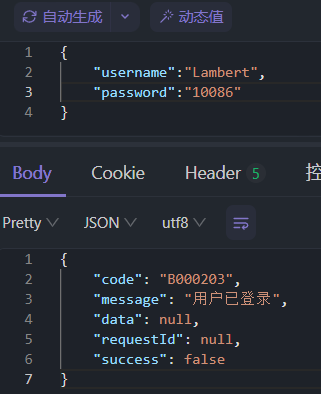

# 开发日志-24-7-13
### 敏感信息加密存储
ShardingSphere中提供了加密存储的功能，我们只需要增加相关的配置即可
```yaml
  - !ENCRYPT
    # 需要加密的表集合
    tables:
      # 用户表
      t_user:
        # 用户表中哪些字段需要进行加密
        columns:
          # 手机号字段，逻辑字段，不一定是在数据库中真实存在
          phone:
            # 手机号字段存储的密文字段，这个是数据库中真实存在的字段
            cipherColumn: phone
            # 身份证字段加密算法
            encryptorName: common_encryptor
          mail:
            cipherColumn: mail
            encryptorName: common_encryptor
        # 是否按照密文字段查询
        queryWithCipherColumn: true
    # 加密算法
    encryptors:
      # 自定义加密算法名称
      common_encryptor:
        # 加密算法类型
        type: AES
        props:
          # AES 加密密钥
          aes-key-value: d6oadClrrb9A3GWo

```

效果如图


### 用户个人信息修改
- DTO   /dto/req/UserUpdateReqDTO
- ServiceImpl
```java
    /**
     * 更新用户信息
     *
     * @param requestParam 更新请求参数
     */
    @Override
    public void update(UserUpdateReqDTO requestParam) {
        // TODO 如果用户未登录，抛出异常进行拦截
        LambdaUpdateWrapper<UserDo> updateWrapper = Wrappers.lambdaUpdate(UserDo.class)
                .eq(UserDo::getUsername, requestParam.getUsername());
        // 根据用户名定位到语句
        baseMapper.update(BeanUtil.toBean(requestParam, UserDo.class), updateWrapper);
    } 
```
- Controller
```java
    /**
     * 用户信息更新接口
     *
     * @param userUpdateReqDTO 更新请求参数
     * @return 空结果
     */
    @PutMapping("/api/shortlink/v1/user")
    public Result<Void> update(@RequestBody UserUpdateReqDTO userUpdateReqDTO) {
        userService.update(userUpdateReqDTO);
        return Results.success();
    }
```

### 用户系统登录功能
- DTO
  - req
  - resp
  - 
- ServiceImpl
  - 这里考虑在登录过程中使用UUID作为token传入到Redis中，记录登录的状态
  - 仅使用token存入到Redis中会存在刷接口的问题，即短时间内重复请求，会不断生成新的token
  - 以"login_"+username的字符串生成一个标识key，然后在redis中存放一个哈希结构的数据，hashkey为token，value为JSON化的UserLoginRespDTO
  - 每次请求的过程中去Redis中判断是否有对应的"login_"+username和token来判断当前用户的登录状态
```java
    /**
     * 用户登录方法
     *
     * @param requestParam 登录请求参数
     * @return 登录响应结果
     */
    @Override
    public UserLoginRespDTO login(UserLoginReqDTO requestParam) {
        // 如果用户已经登录，则抛出用户登录的异常，捕获信息
        String requestUsernameKey = "login_" + requestParam.getUsername();
        if (redissonClient.getKeys().countExists(requestUsernameKey) >= 1) {
            throw new ClientException(USER_LOGIN_ALREADY);
        }

        // 从数据库中找到当前的用户
        LambdaQueryWrapper<UserDo> queryWrapper = Wrappers.lambdaQuery(UserDo.class)
                .eq(UserDo::getUsername, requestParam.getUsername())
                .eq(UserDo::getPassword, requestParam.getPassword())
                .eq(UserDo::getDelFlag, 0);

        UserDo userDo = baseMapper.selectOne(queryWrapper);

        // 根据用户名和密码验证了用户成功后，生成token
        if (userDo == null) {
            throw new ClientException(USER_NULL);
        }

        String loginKey = "login_" + userDo.getUsername();
        // 以UUID作为token
        UUID token = UUID.randomUUID();

        // 将已登录的用户信息存放到Redis中
        stringRedisTemplate.opsForHash().put(loginKey, token.toString(), JSON.toJSONString(userDo));
        stringRedisTemplate.expire(loginKey, 30, TimeUnit.MINUTES);
        return new UserLoginRespDTO(token.toString());
    }
```

运行效果





- Controller
```java
    /**
     * 检查用户登录状态
     *
     * @param username 用户名
     * @param token    用户令牌
     * @return 登录状态结果
     */
    @GetMapping("/api/shortlink/v1/user/check-login")
    public Result<Boolean> checkLogin(@RequestParam("username") String username, @RequestParam("token") String token) {
        return Results.success(userService.checkLoginStatus(username, token));
    }
```
