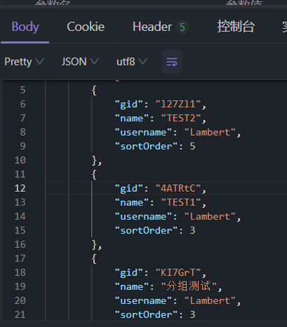
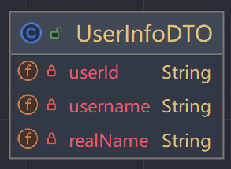
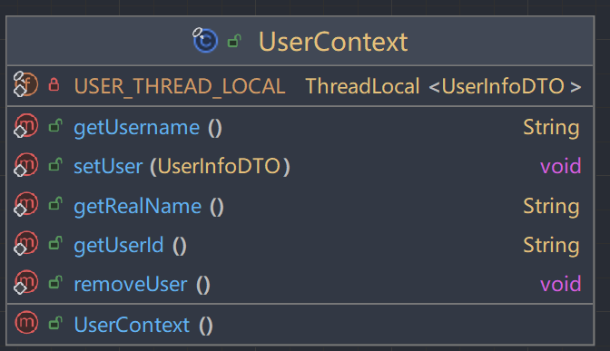
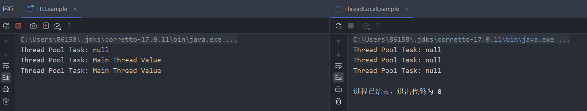
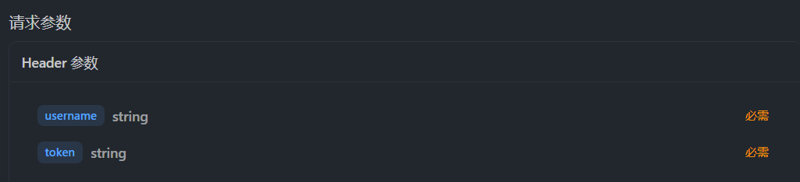

# 开发日志-24-7-13
### 新增短链接分组

### 查询短链接分组



### 用户上下文实体设计
在开发过程中发现很大部分都需要用到传输的用户上下文，比如说在接口开发过程中多次使用到用户名
```java
    @Override
    public List<ShortLinkGroupRespDTO> listGroup() {
        // TODO 获取用户名
        LambdaQueryWrapper<GroupDo> queryWrapper = Wrappers.lambdaQuery(GroupDo.class)
                .eq(GroupDo::getDelFlag, 0)
                .eq(GroupDo::getUsername, "Lambert")
                .orderByDesc(GroupDo::getSortOrder, GroupDo::getUpdateTime);
        List<GroupDo> groupDoList = baseMapper.selectList(queryWrapper);
        return BeanUtil.copyToList(groupDoList, ShortLinkGroupRespDTO.class);
    }

    /**
     * 判断数据库中是否存在随机生成的Gid
     * @return true是存在
     */
    private boolean hasGid(String gid) {
        LambdaQueryWrapper<GroupDo> queryWrapper = Wrappers.lambdaQuery(GroupDo.class)
                .eq(GroupDo::getGid, gid)
                // TODO 设置用户名 你的用户名是通过网关传输过来并进行解析，不能通过用户来传这个username，可能会有盗接口刷的风险
                .eq(GroupDo::getUsername, null);
        GroupDo hasGroupFlag = baseMapper.selectOne(queryWrapper);
        return hasGroupFlag != null;
    }
```
因此，我们需要实体类对象来封装和传输登录后的用户上下文信息，以方便在使用接口时可以获取到用户信息





这里引申一下ThreadLocal的知识点，ThreadLocal是Java中用于在每个线程中存储独立变量的类。
- 线程隔离 ThreadLocal使得每个线程都有自己独立的变量副本，不同线程间的变量不会相互影响。
- 简化线程安全 需要使用同步机制来实现线程安全，从而简化了代码的编写和维护。

但是ThreadLocal会有什么局限性呢？
- 跨线程池的上下文传递

在使用线程池时，线程是被重用的。在标准的ThreadLocal中，在线程池中线程执行任务时，每个任务的上下文是独立的，不会自动传递ThreadLocal变量。这导致了一些需要跨线程池传递的上下文信息无法有效传递，例如用户信息、跟踪信息等。

- 异步执行中的上下文传递

在异步执行任务（例如通过CompletableFuture、ExecutorService等）时，标准的ThreadLocal变量不会自动传递给异步执行的线程。这导致了异步执行过程中上下文信息的丢失。

这里的UserContext需要封装UserInfo对象，如果使用ThreadLocal会存在下面问题：

- 上下文丢失
- 线程复用问题
- 复杂的手动传递

使用 TransmittableThreadLocal 可以确保在线程池环境下，线程上下文信息能够正确传递，避免上下文丢失和线程复用导致的数据混乱问题。
它实现了一种“线程上下文传递”的机制，使得上下文信息可以在跨线程池或异步执行中被传递。

```java
// 阿里巴巴开源的TTL 线程安全的ThreadLocal 能够实现没有任何关系的类间跨线程的传递
// 意味着即便在多线程的情况下也能获取到线程信息
private static final ThreadLocal<UserInfoDTO> USER_THREAD_LOCAL = new TransmittableThreadLocal<>();
```

测试：向线程池中提交三个任务，提交第二个任务前向ThreadLocal设置值



### 用户上下文拦截
#### 过滤器概念
Filter也称之为过滤器，它是Servlet技术中最实用的技术，Web开发人员通过Filter技术，对web服务器管理的所有web资源
- 在HttpServletRequest到达 Servlet 之前，拦截客户的HttpServletRequest 。根据需要检查HttpServletRequest，也可以修改HttpServletRequest 头和数据。
- 在HttpServletResponse到达客户端之前，拦截HttpServletResponse 。根据需要检查HttpServletResponse，也可以修改HttpServletResponse头和数据。
```java
/**
 * Filter接口用于对资源的请求或响应进行过滤，或者同时对请求和响应进行过滤。
 * 过滤器通常用于记录日志、审计、输入验证以及其他预处理或后处理操作。
 */
public interface Filter {

    /**
     * 初始化过滤器。
     * 当过滤器被实例化时，Web容器会调用此方法一次。
     * 它提供了一个FilterConfig对象，过滤器可以使用该对象获取其初始化参数，
     * 并获取对ServletContext的引用，例如可以用来获取应用级别的资源。
     *
     * @param filterConfig 过滤器配置对象，包含初始化参数和ServletContext的引用
     * @throws ServletException 如果初始化失败
     */
    default void init(FilterConfig filterConfig) throws ServletException {
    }

    /**
     * 对请求和响应进行过滤。
     * 每次请求/响应对通过过滤器链时，Web容器会调用此方法。
     * 过滤器可以通过调用FilterChain的doFilter方法将请求和响应传递给下一个实体（过滤器或资源）。
     * 开发人员可以根据需求决定是否调用doFilter，调用该方法，则web服务器就会调用web资源的service方法，即web资源就会被访问，否则web资源不会被访问。
     *
     * @param request  Servlet请求对象
     * @param response Servlet响应对象
     * @param chain    过滤器链对象，用于将请求和响应传递给下一个过滤器或目标资源
     * @throws IOException      如果处理请求或响应时发生I/O错误
     * @throws ServletException 如果处理请求或响应时发生其他错误
     */
    void doFilter(ServletRequest request, ServletResponse response, FilterChain chain) throws IOException, ServletException;

    /**
     * 销毁过滤器。
     * 当过滤器被从服务中移除时，Web容器会调用此方法一次，以便清理资源。
     */
    default void destroy() {
    }
}
```

在这里我们可以通过实现重写doFilter方法 来实现对于非登录请求的拦截
- 放行登录接口
- 查询Redis中是否存在用户登录的token，如果存在，则用户已登录，进行放行，并在TTL中设置用户信息UserInfoDo
```java
public void doFilter(ServletRequest servletRequest, ServletResponse servletResponse, FilterChain filterChain) {
    HttpServletRequest httpServletRequest = (HttpServletRequest) servletRequest;

    // 对登录接口进行放行
    String requestURL = httpServletRequest.getRequestURI();
    if (!"/api/shortlink/v1/user/login".equals(requestURL)) {

        // 判断用户是否登录 需要获取当前的username和token
        String username = httpServletRequest.getHeader("username");
        String token = httpServletRequest.getHeader("token");

        // 从Redis中获取到已经登录的实体对象DTO
        Object userInfoJsonStr = stringRedisTemplate.opsForHash().get("login_" + username, token);

        if (userInfoJsonStr != null) {
            // 如果已经登录 将用户信息加入用户上下文中
            UserInfoDTO userInfoDTO = JSON.parseObject(userInfoJsonStr.toString(), UserInfoDTO.class);
            UserContext.setUser(userInfoDTO);
        }
    }
    try {
        filterChain.doFilter(servletRequest, servletResponse);
    } finally {
        // 最后防止内存泄露
        UserContext.removeUser();
    }
}
```

在实现了Filter后，我们还需要对其进行配置
```java
/**
 * 用户配置自动装配
 */
@Configuration
public class UserConfiguration {

    /**
     * 用户信息传递过滤器
     */
    @Bean
    public FilterRegistrationBean<UserTransmitFilter> globalUserTransmitFilter(StringRedisTemplate stringRedisTemplate) {
        FilterRegistrationBean<UserTransmitFilter> registration = new FilterRegistrationBean<>();   // Filter配置类方法需要返回一个FilterRegistrationBean对象
        registration.setFilter(new UserTransmitFilter(stringRedisTemplate));        // 设置过滤器
        registration.addUrlPatterns("/*");  // 配置过滤规则
        registration.setOrder(0);   // 过滤器的执行顺序
        return registration;
    }
}

```

这样的话，我们就实现了对非登录请求的过滤，我们在进行登录后的接口操作时，需要在Header中带上username和token
