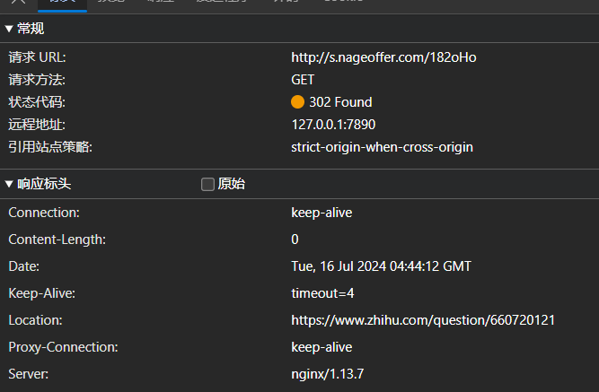
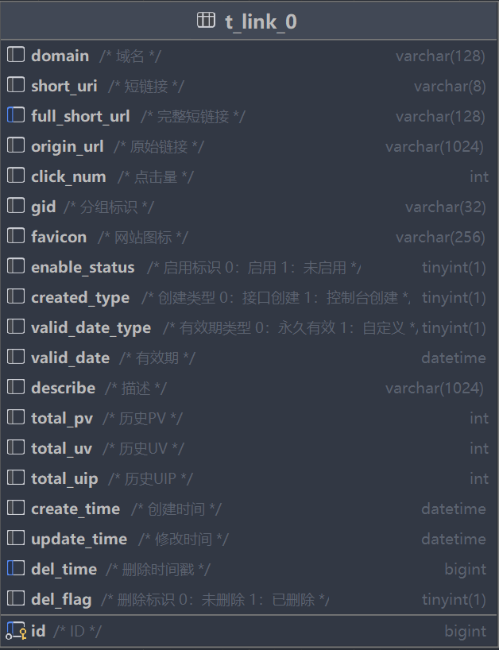
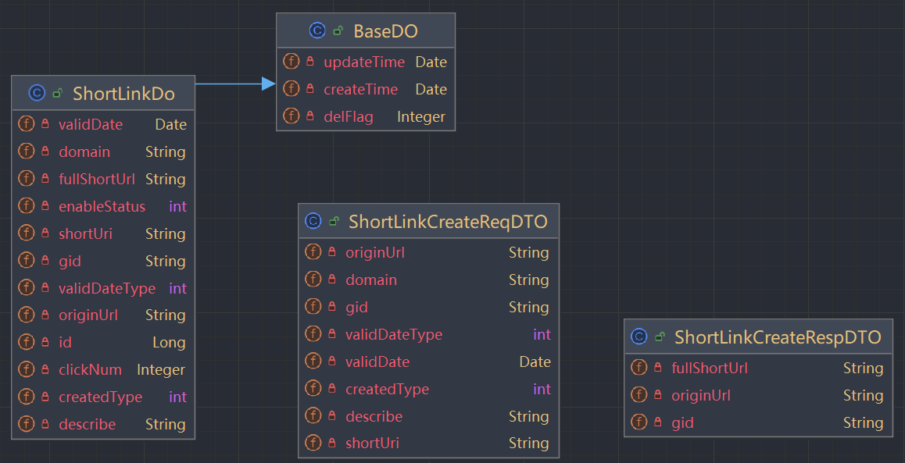
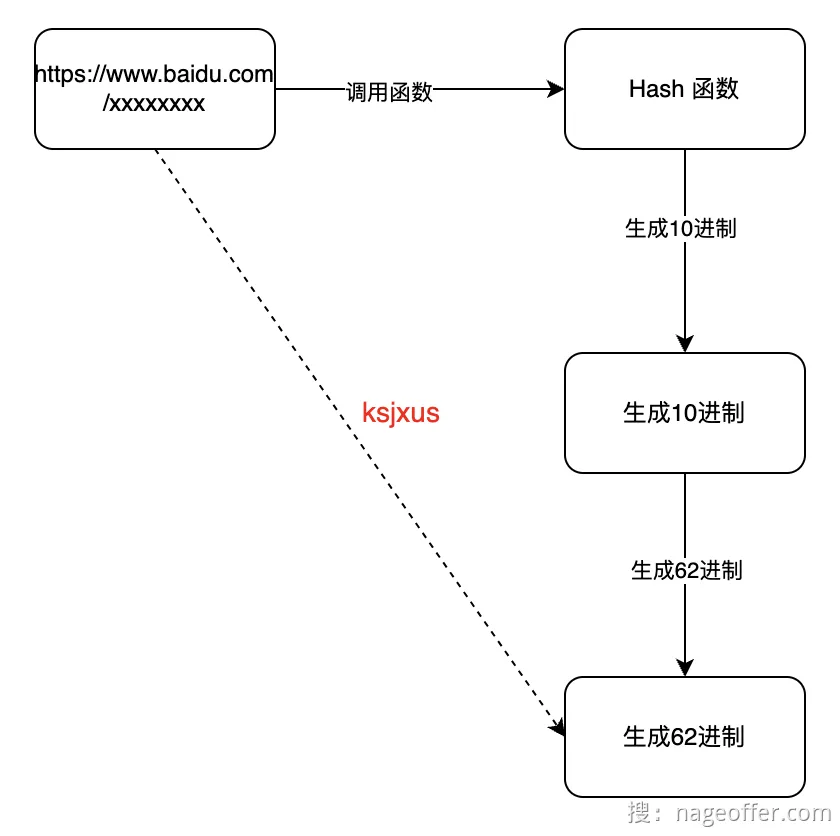
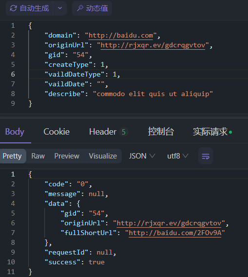
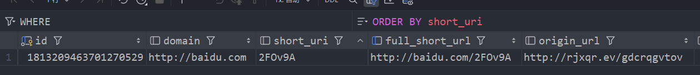

# 短链接管理
### 核心功能分析
- 新增短链接
- Host添加域名映射
- 分页查询短链接集合
- 编辑短链接
- 删除短链接
### 原理实现
请求短链接时,重定向到长链接的URL



### 重定向
- 301永久重定向：资源已被永久移动到新位置。浏览器和搜索引擎会缓存这个重定向。这意味着将来对旧URL的请求会直接重定向到新URL，而不需要再次发送请求到服务器。
- 302短暂重定向：资源暂时被移动到新位置。浏览器和搜索引擎通常不会缓存这个重定向。这意味着每次对旧URL的请求都会发送到服务器，再由服务器重定向到新URL。

考虑到后期需要实现对于短链接请求信息的监控和用户行为追踪，考虑使用302重定向


### 短链中台数据库表及实体设计





### 分库分表
```yaml
# 分库分表的核心配置
# 数据源集合
dataSources:
  ds_0:
    dataSourceClassName: com.zaxxer.hikari.HikariDataSource
    driverClassName: com.mysql.cj.jdbc.Driver
    jdbcUrl: jdbc:mysql://127.0.0.1:3306/link?useUnicode=true&characterEncoding=UTF-8&rewriteBatchedStatements=true&allowMultiQueries=true&serverTimezone=Asia/Shanghai
    username: root
    password: root

# 分片规则
rules:
  - !SHARDING
    tables:
      t_link:
        # 真实数据节点，比如数据库源以及数据库在数据库中真实存在的
        actualDataNodes: ds_0.t_link_${0..15}
        # 分表策略
        tableStrategy:
          # 用于单分片键的标准分片场景
          standard:
            # 分片键
            shardingColumn: domain
            # 分片算法，对应 rules[0].shardingAlgorithms
            shardingAlgorithmName: user_table_hash_mod
    # 分片算法
    shardingAlgorithms:
      # 数据表分片算法
      user_table_hash_mod:
        # 根据分片键 Hash 分片
        type: HASH_MOD
        # 分片数量
        props:
          sharding-count: 16

# 展现逻辑 SQL & 真实 SQL
props:
  sql-show: true
```

### 新增短链接
#### 生成短链接生成算法
将输入字符串进行MurmurHash计算，生成一个唯一的 10 进制数，并将结果转换为Base62编码。



#### 新增功能实现
- Controller
```java
/**
     * 新增短链
     * @param requestParam
     * @return
     */
    @PostMapping("/api/short-link/project/v1/create")
    public Result<ShortLinkCreateRespDTO> createShortLink(@RequestBody ShortLinkCreateReqDTO requestParam) {
        return Results.success(shortlinkService.createShortLink(requestParam));
    }
```
- ServiceImpl
```java
    @Override
    public ShortLinkCreateRespDTO createShortLink(ShortLinkCreateReqDTO requestParam) {
        // 根据源URL生成短链接
        String shortLinkSuffix = generateSuffix(requestParam);

        // 构造LinkDo 插入到数据库
        ShortLinkDo shortLinkDo = BeanUtil.toBean(requestParam, ShortLinkDo.class);
        shortLinkDo.setFullShortUrl(requestParam.getDomain() + "/" + shortLinkSuffix);
        shortLinkDo.setShortUri(shortLinkSuffix);
        baseMapper.insert(shortLinkDo);

        return ShortLinkCreateRespDTO.builder()
                .gid(requestParam.getGid())
                .originUrl(requestParam.getOriginUrl())
                .fullShortUrl(shortLinkDo.getFullShortUrl())
                .build();
    }

    public String generateSuffix(ShortLinkCreateReqDTO requestParam) {
        String originUrl = requestParam.getOriginUrl();
        return HashUtil.hashToBase62(originUrl);
    }
```

测试接口



