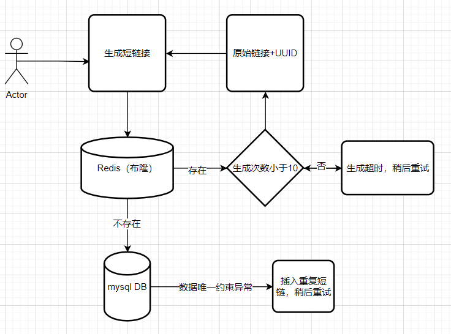
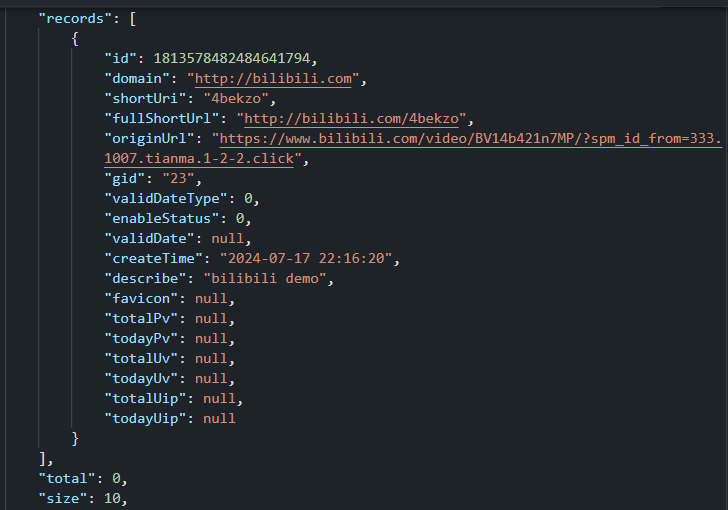
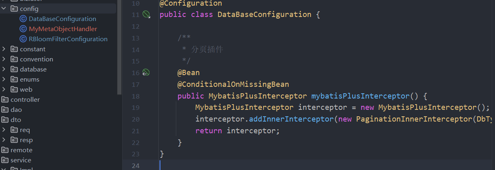
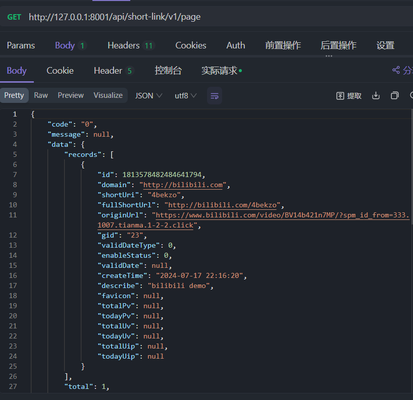

### 短链接创建需要解决的问题
#### 短链接不可重复
在进行短链接数据库查询的过程中，我们使用short_url条件进行查询
```sql
select * from t_link where short_url = '2FOV9A'
```
如果我们数据库表中的short_url为'2FOv9A'，可以发现只是存在大小写字符的差别，也能查询，造成了不一致的现象

原因其实出现在mysql对于字段的编码中，默认是**utf8mb4_beneral_ci**，这种是不区分大小写的

我们需要对大小写敏感的字段进行编码区分

```sql
short_uri       varchar(8) collate utf8_bin   null comment '短链接',
```

在生成短链接时，使用的是hutool包下的MurmurHash哈希算法，这里必然会存在一个冲突的情况，不过概率很低。我们的业务场景对于短链接容错是比较低
的，所以需要进一步去对generateSuffix进行优化。

**思路**
- 生成短链算法加盐
  - 出现冲突后，生成新的短链。这里一开始是想用时间戳的，但是考虑到在极端的并发场景中，可能会出现同一毫秒中生成相同的短链，导致冲突。因此使用UUID进行加盐
- 设置最大重试次数
  - 出现冲突的情况，设置最大重试的次数防止频繁生成短链接，造成资源浪费
- 分布式锁
  - 描述：每次生成shortLinkSuffix后获取分布式锁去查询数据库，检查生成是否存在冲突
  - 问题：性能低，加锁和解锁需要消耗额外的性能。无法支持高并发的业务场景
- 布隆过滤器
  - 描述：生成未冲突的shortLinkSuffix后加入到布隆过滤器中，每次新生成shortLinkSuffix布隆过滤器拦截已经生成的短链
  - 问题：布隆过滤器里面的数据越来越多时，会频繁地出现误判，导致需要重复生成短链

```java
private final RBloomFilter<String> shortUriCreateCachePenetrationBloomFilter;
private final StringRedisTemplate stringRedisTemplate;

@Override
public ShortLinkCreateRespDTO createShortLink(ShortLinkCreateReqDTO requestParam) {
  if(stringRedisTemplate.opsForValue().get(requestParam.getOriginUrl()) != null){
    // 说明源链接已经生成了，所以不生成
    throw new ClientException(LINK_CREATE_ALREADY);
  }
  // 根据源URL生成短链接
  String shortLinkSuffix = generateSuffix(requestParam);
  String fullShortUrl = requestParam.getDomain() + "/" + shortLinkSuffix;

  // 构造LinkDo 插入到数据库
  ShortLinkDo shortLinkDo = BeanUtil.toBean(requestParam, ShortLinkDo.class);
  shortLinkDo.setFullShortUrl(fullShortUrl);
  shortLinkDo.setShortUri(shortLinkSuffix);

  try {
    // 在生成shortLinkSuffix时“保证”了该shortLinkSuffix不存在数据库，为什么还要加一层异常处理呢？
    // 个人理解是，可能存在了数据插入到数据库但还没来得及加到布隆过滤器中
    // 可能是进程挂掉了 由于这里没有加事务，入库的操作还没来得及回滚
    // 也可能是极端高并发的场景下导致的
    // 所以使用异常处理捕获数据库中的数据约束，重复数据的异常，进行兜底
    baseMapper.insert(shortLinkDo);
    stringRedisTemplate.opsForValue().set(requestParam.getOriginUrl(), "0");
  }catch (DuplicateKeyException ex){
    String errorMsg = "短链接:" + fullShortUrl + "重复入库";
    log.warn(errorMsg);
    throw new ServiceException("短链接生成重复");
  }

  shortUriCreateCachePenetrationBloomFilter.add(shortLinkSuffix);

  return ShortLinkCreateRespDTO.builder()
          .gid(requestParam.getGid())
          .originUrl(requestParam.getOriginUrl())
          .fullShortUrl(shortLinkDo.getFullShortUrl())
          .build();
}

public String generateSuffix(ShortLinkCreateReqDTO requestParam) {
  int customGenerateCount = 0;
  String shortUri = null;
  while(true){
    // 最大重试次数为10
    if(customGenerateCount == 10){
      throw new ClientException(SERVICE_TIMEOUT_ERROR);
    }
    // 加上时间戳来进行哈希
    String originUrlWithTime = requestParam.getOriginUrl() + UUID.randomUUID();
    shortUri = HashUtil.hashToBase62(originUrlWithTime);

    // 使用布隆过滤器进行重复判断
    if(!shortUriCreateCachePenetrationBloomFilter.contains(shortUri)){
      break;
    }
    customGenerateCount++;
  }
  return shortUri;
}
```
#### 短链接数据库中唯一性如何保证
- 通过UIQUE唯一性约束保证数据完整性
```sql
 unique (full_short_url, del_time)
```
- 已经实现了冲突短链的重新生成，为何还要保证数据唯一性约束？
  - 插入数据库过程中进程挂了 没有事务回滚



#### 同一个链接重复生成
为了避免反复生成同一个原链接的短链，使用Redis记录

### 分库分表
#### 分表的数量规范
这个问题没有标准的答案，更多是从两个角度来进行考虑
- 性能
出现明显的性能查询瓶颈
- 业务
  - 现有业务的数据量
  - 业务数据的增长量

比较重要的共识是：表可以多，表中数据可以少 

如果一开始的表数量设计得比较少，再进行扩容的话，那就是在高速上换车胎，需要考虑的因素非常多。

### 分页功能开发
参考文档:https://baomidou.com/plugins/pagination/#_top

baseMapper中有一个<P extends IPage<T>> P selectPage(P page, @Param("ew") Wrapper<T> queryWrapper);

通过这个方法返回一个IPage对象


- service
```java
@Override
    public IPage<ShortLinkPageRespDTO> pageShortLink(ShortLinkPageReqDTO requestParam) {
        LambdaQueryWrapper<ShortLinkDo> queryWrapper = Wrappers.lambdaQuery(ShortLinkDo.class)
                .eq(ShortLinkDo::getGid, requestParam.getGid())
                .eq(ShortLinkDo::getDelFlag, 0)
                .eq(ShortLinkDo::getEnableStatus, 0)
                .orderByDesc(ShortLinkDo::getCreateTime);


        IPage<ShortLinkDo> resultPage = baseMapper.selectPage(requestParam, queryWrapper);
        // 用于将分页查询结果转换为另一种类型的列表。
        return resultPage.convert(each -> BeanUtil.toBean(each, ShortLinkPageRespDTO.class));
    }
```

问题记录



这里total为0 需要配置一下分页插件


问题解决


