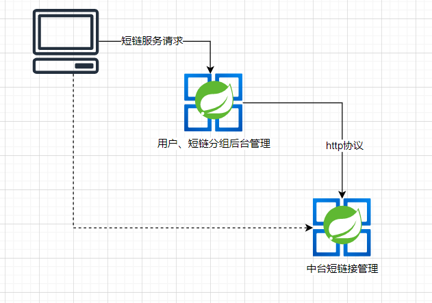
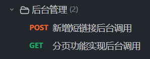
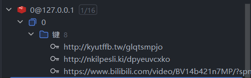
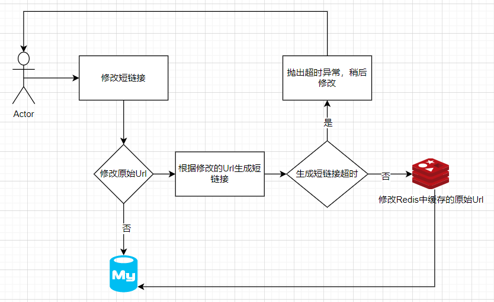
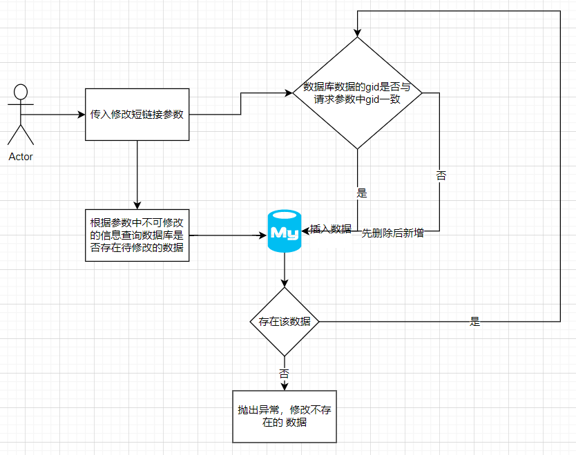

# 24-7-19开发日志
### 短链后台调用中台服务


- ServiceImpl
通过http协议来向中台相关api发起请求
admin/remote/dto/ShortLinkRemoteService

```java
public interface ShortLinkRemoteService {
    default Result<ShortLinkCreateRespDTO>createShortLink(ShortLinkCreateReqDTO requestParam){
        String resultBodyStr = HttpUtil.post("http://127.0.0.1:8001/api/short-link/project/v1/create", JSON.toJSONString(requestParam));
        return JSON.parseObject(resultBodyStr,new TypeReference<>(){});
        // 这个TypeReference是解决泛型中类型擦除无法判断是什么类型
    }

    default Result<IPage<ShortLinkPageRespDTO>> pageShortLink(ShortLinkPageReqDTO requestParam){
        Map<String,Object> request = new HashMap<>();
        request.put("gid",requestParam.getGid());
        request.put("orderTag",requestParam.getOrderTag());
        request.put("size", requestParam.getSize());
        String resultPageStr = HttpUtil.get("http://127.0.0.1:8001/api/short-link/project/v1/page",request);

        return JSON.parseObject(resultPageStr,new TypeReference<>(){});
    }
}

```

- 接口文档声明



### 修改短链
我们在之前实现了短链接原始Url缓存功能，防止用户重复使用同一Url刷接口
```java
if(stringRedisTemplate.opsForValue().get(requestParam.getOriginUrl()) != null){
    // 说明源链接已经生成了，所以不生成
    throw new ClientException(LINK_CREATE_ALREADY);
}
```



因此我们需要对修改短链接的行为进行分类
- 修改了Origin_URL
- 没有修改Origin_URL

代码逻辑如下流程图



