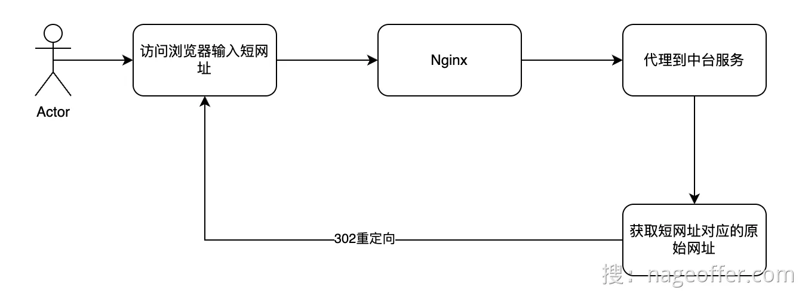
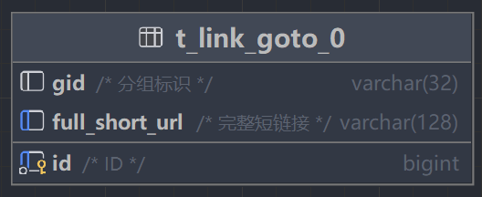
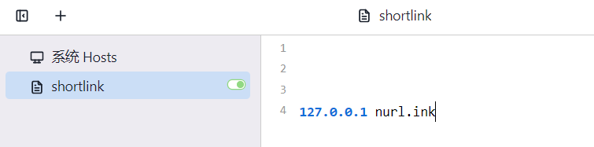
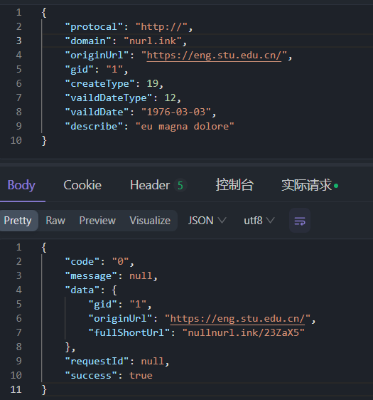
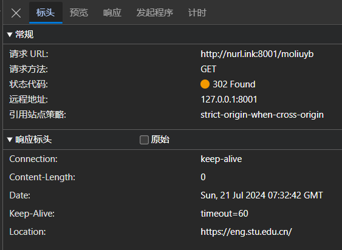

# 24-7-20开发日志
### 实现短链接跳转
#### 原理
在测试阶段暂时在后台写死重定向，实现业务功能为主



#### 业务场景问题
- 缓存穿透：向后端发起不存在的短链请求，导致数据库压力激增
- 缓存击穿：热点的短链缓存过期，导致大量请求打到数据库


#### 功能实现
在拦截到进行短链接请求后，如果直接进行查询的话可能会造成读扩散的问题：
 - 即分库分表，无法定位到是哪张表的数据，需要在n张表中分别执行同一条sql语句
考虑到分表的分片键是gid，可以考虑以gid和fullShortLink创建路由表



短链功能实现如下
- 根据后端拦截到的请求信息，拼接短链接fullShortUrl
- 在跳转表中查找gid
- 得到gid后，根据gid和完整短链接fullShortUrl来短链表中查询行数据
- 如果查询到则进行重定向的跳转


```java
/**
     * 短链接跳转
     * @param shortUri 短链接后缀
     * @param request  短链接请求
     * @param response 短链接响应
     * @throws IOException
     */
    @Override
    public void restoreUrl(String shortUri, ServletRequest request, ServletResponse response) throws IOException {
        // 根据请求拼接完整短链接
        String serverName = request.getServerName();
        String fullShortUrl = serverName + "/" + shortUri;

        // 查询跳转表中是否存在
        LambdaQueryWrapper<ShortLinkGoto> linkGotoQueryWrapper = Wrappers.lambdaQuery(ShortLinkGoto.class)
                .eq(ShortLinkGoto::getFullShortUrl, fullShortUrl);
        ShortLinkGoto shortLinkGoto = shortLinkGotoMapper.selectOne(linkGotoQueryWrapper);

        if (shortLinkGoto == null) {
            // TODO 封控？
            return;
        }
        
        // 查询短链信息表中是否存在相应的短链接行数据
        LambdaQueryWrapper<ShortLinkDo> queryWrapper = Wrappers.lambdaQuery(ShortLinkDo.class)
                // TODO 传进来的只有shortUri，没有Gid，这样的话无法查到对应分片的数据库
                //  -> goto路由表解决 根据short_url找到对应的分片键
                //  借鉴这种策略的思想也能很好地解决分表的“读扩散问题” -> 建立一个路由索引
                .eq(ShortLinkDo::getGid, shortLinkGoto.getGid())
                .eq(ShortLinkDo::getFullShortUrl, fullShortUrl)
                .eq(ShortLinkDo::getDelFlag, 0)
                .eq(ShortLinkDo::getEnableStatus, 0);
        ShortLinkDo shortLinkDo = baseMapper.selectOne(queryWrapper);
        
        // 重定向跳转
        if (shortLinkDo != null) {
            // 进行跳转
            ((HttpServletResponse) response).sendRedirect(shortLinkDo.getOriginUrl());
        }
    }
```

#### 本地调试
- 配置测试本地运行的服务

使用switchHost工具，将nurl.ink解析为本地主机127.0.0.1。



- 新增短链



- 浏览器运行


成功重定向

