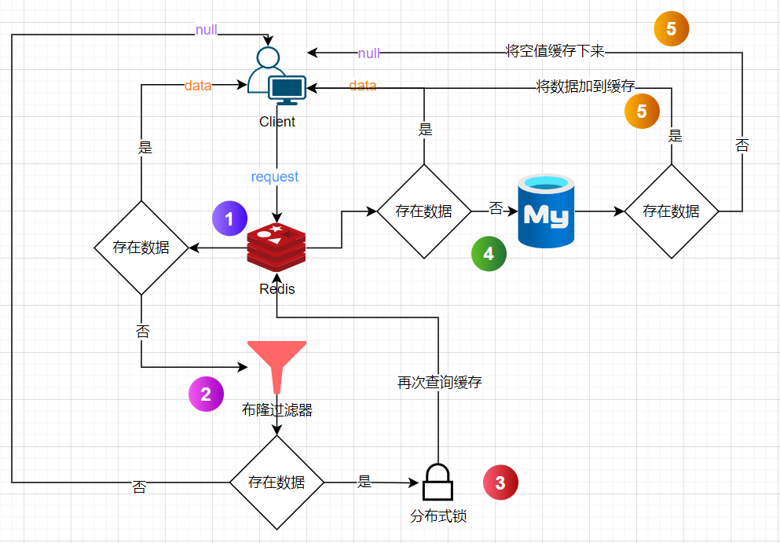

# 24-7-22开发日志
### 跳转短链接可能会出现的并发问题
#### 缓存穿透
- 短期缓存空值 -> 大量恶意请求，Redis缓存较多的空值，还是扛不住
- 布隆过滤器 -> 由于存在哈希碰撞导致误判，小概率恶意请求放行，持续打到数据库
#### 缓存击穿
- 分布式锁 -> 性能较低，无法满足高并发的场景
#### 缓存雪崩
- 缓存预热
  - 运行前 -> 将热点数据提前放到redis缓存
  - 运行时 -> 轮询热点数据，即将过期的数据热重载

### 跳转架构设计
