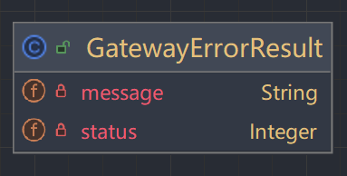

# 24-8-6微服务改造
### 注册中心理论

- 1、服务注册/服务发现
  - 注册中心如何管理服务
    - 服务端通过引入相关的依赖，并配置服务发现端（注册中心）的端口信息，将其注册
    - 注册中心维护服务节点的列表，并通过心跳机制来保证服务的可用
  - 注册中心如何加速服务相应？如果服务结点修改如何处理
    - 在注册中心中存在服务节点列表的缓存机制，如果服务节点有变化时，Client 与 Registry 需要保持数据同步
- 2、服务下线的过程(类比四次挥手的思想)
  - Server 通知 Registry 当前节点（A）即将下线
  - Registry 通知 Client，Server 的 A 节点下线
  - Client 收到通知后，更新本地缓存的节点列表，选择 Server 的其他节点发请求
  - Server 等待一段时间后（防止网络延迟，有一些存量请求需要处理），暂停服务并下线
- 3、注册中心如何保证服务可用
  - 心跳机制：Server 每隔几秒向 Registry 发送心跳包，收到响应则表示服务节点正常，在指定时间内没收到响应，则判定为失败
    注册中心发现某个节点不可用时，会通知 Client，Client 更新本地缓存的服务节点列表
  - 如果心跳机制出现节点不可用的情况，小概率原因是网络抖动。为了保证可用性，会先更新服务节点列表，将请求打到其他节点，稳住调用方。然后再次向服务端发起心跳确定，如果发几次心跳都是失败的，才认为服务节点不可用。如果心跳恢复，再告知 Client 服务节点可用。
- 4、注册中心的选型——CAP角度分析

  - C一致性(区别于数据库事务的C：一个是状态一致性 一个是数据副本逻辑一致性)
  - A可用性
  - P分区容错性
  
如何权衡？

在保证 P 的前提下， CA 难以同时满足，只能说在 CP 下尽量保证 A，在 AP 下尽量保证 C

**CP or AP**

CP：牺牲一定的可用性，保证强一致性，典型代表有 ZooKeeper、etcd
AP：牺牲一定的一致性，保证高可用性，典型代表有 Eureka、Nacos

**选型：**

- 体量小，集群规模不大的时候，CP 可以满足需要
- 体量大，有大批量服务节点需要同时上下线，选择 AP

注册中心可能会负载过高：有大量的节点变更的请求、服务节点列表下发不及时
强一致性，就需要同步大量节点之间的数据，服务可能长时间不可用

### 网关理论
引入网关提供下面的服务
- 路由管理 流量隔离 -> 应用于灰度发布、隔离联调环境
- 安全性(鉴权)管理：https 访问、黑白名单、用户登录和数据请求加密放篡改等。
- 负载均衡问题。
- 限流熔断降级
- 监控和日志集中管理。
- 统一的 API 管理。 -> api gateway

## 实操环节
### 服务注册配置
- 服务方
启动类注解@EnableDiscoveryClient
```xml
<dependency>
  <groupId>com.alibaba.cloud</groupId>
  <artifactId>spring-cloud-starter-alibaba-nacos-discovery</artifactId>
</dependency>
```
- 调用方
启动类注解@EnableFeignClients
```xml
<dependency>
  <groupId>com.alibaba.cloud</groupId>
  <artifactId>spring-cloud-starter-alibaba-nacos-discovery</artifactId>
</dependency>
<dependency>
  <groupId>org.springframework.cloud</groupId>
  <artifactId>spring-cloud-starter-openfeign</artifactId>
</dependency>
        <!-- openfeign 已不再提供默认负载均衡器 -->
<dependency>
  <groupId>org.springframework.cloud</groupId>
  <artifactId>spring-cloud-loadbalancer</artifactId>
</dependency>
```
### OpenFeign调用改造

在调用端声明相应的服务接口和Controller即可，这里展示服务接口

```java
/**
 * 短链接中台远程调用
 */
@FeignClient(value = "short-link-project")
public interface ShortLinkActualRemoteService {

    @PostMapping("/api/short-link/project/v1/create")
    Result<ShortLinkCreateRespDTO> createShortLink(@RequestBody ShortLinkCreateReqDTO requestParam);

    @GetMapping("/api/short-link/project/v1/page")
    Result<Page<ShortLinkPageRespDTO>> pageShortLink(@RequestParam("gid") String gid,
                                                     @RequestParam("orderTag") String orderTag,
                                                     @RequestParam("current") Long current,
                                                     @RequestParam("size") Long size);

    @PutMapping("/api/short-link/project/v1/update")
    public Result<Void> updateShortLink(@RequestBody ShortLinkUpdateReqDTO requestParam);

    @PostMapping("/api/short-link/project/v1/delete")
    public Result<Void> deleteShortLink(@RequestBody ShortLinkDeleteReqDTO requestParam);
}

```
### 网关引入
- 配置

依赖
```xml
<dependencies>
    <dependency>
        <groupId>org.springframework.cloud</groupId>
        <artifactId>spring-cloud-starter-gateway</artifactId>
    </dependency>

    <dependency>
        <groupId>org.springframework.cloud</groupId>
        <artifactId>spring-cloud-loadbalancer</artifactId>
    </dependency>

    <!-- Unable to load io.netty.resolver.dns.macos.MacOSDnsServerAddressStreamProvider xxx -->
    <dependency>
        <groupId>io.netty</groupId>
        <artifactId>netty-all</artifactId>
    </dependency>

    <dependency>
        <groupId>com.alibaba.cloud</groupId>
        <artifactId>spring-cloud-starter-alibaba-nacos-discovery</artifactId>
    </dependency>

    <dependency>
        <groupId>org.springframework.boot</groupId>
        <artifactId>spring-boot-starter-data-redis</artifactId>
    </dependency>

    <dependency>
        <groupId>com.alibaba.fastjson2</groupId>
        <artifactId>fastjson2</artifactId>
    </dependency>
</dependencies>

<build>
    <finalName>${project.artifactId}</finalName>
    <plugins>
        <plugin>
            <groupId>org.springframework.boot</groupId>
            <artifactId>spring-boot-maven-plugin</artifactId>
            <executions>
                <execution>
                    <goals>
                        <goal>repackage</goal>
                    </goals>
                </execution>
            </executions>
        </plugin>
    </plugins>
</build>
```

具体配置信息
```yaml
server:
  port: 8000  # 网关端口
spring:
  # 服务名 用于服务发现
  application:
    name: short-link-gateway
  data:
    redis:
      host: 127.0.0.1
      port: 6379
      password: 123456
  cloud:
    nacos:
      discovery:
        server-addr: 127.0.0.1:8848
    # 网关配置信息
    gateway:
      routes: # 声明了两个路由
        - id: short-link-admin
          uri: lb://short-link-admin/api/short-link/admin/**
          predicates:
            - Path=/api/short-link/admin/**
          filters:
            - name: TokenValidate
              args:
                whitePathList:  # 鉴权白名单
                  - /api/short-link/admin/v1/user/login
                  - /api/short-link/admin/v1/user/has-username

        - id: short-link-project
          uri: lb://short-link-project/api/short-link/**
          predicates:
            - Path=/api/short-link/**
          filters:
            - name: TokenValidate
```
- 创建启动类
```java
/**
 * 网关服务应用启动器
 */
@SpringBootApplication
public class GatewayServiceApplication {

    public static void main(String[] args) {
        SpringApplication.run(GatewayServiceApplication.class, args);
    }
}
```
- 实现拦截器逻辑
  - 相应实体封装(后端避免暴露过多数据给前端) 




  - 用户白名单(登录状态鉴权)
```java
/**
 * 过滤器配置
 */
@Data
public class Config {

    /**
     * 白名单前置路径
     */
    private List<String> whitePathList;
}
```
  - 拦截功能
```java
@Override
    public GatewayFilter apply(Config config) {
        return (exchange, chain) -> {
            ServerHttpRequest request = exchange.getRequest();
            String requestPath = request.getPath().toString();
            String requestMethod = request.getMethod().name();
            if (!isPathInWhiteList(requestPath, requestMethod, config.getWhitePathList())) {    // 如果不在白名单中
                String username = request.getHeaders().getFirst("username");
                String token = request.getHeaders().getFirst("token");
                Object userInfo;
                if (StringUtils.hasText(username) && StringUtils.hasText(token) && (userInfo = stringRedisTemplate.opsForHash().get("short-link:login:" + username, token)) != null) {
                    // 如果验证成功
                    JSONObject userInfoJsonObject = JSON.parseObject(userInfo.toString());
                    ServerHttpRequest.Builder builder = exchange.getRequest().mutate().headers(httpHeaders -> {
                        httpHeaders.set("userId", userInfoJsonObject.getString("id"));
                        httpHeaders.set("realName", URLEncoder.encode(userInfoJsonObject.getString("realName"), StandardCharsets.UTF_8));
                    });
                    return chain.filter(exchange.mutate().request(builder.build()).build());
                }
                // 验证失败，客户端返回错误信息
                ServerHttpResponse response = exchange.getResponse();
                response.setStatusCode(HttpStatus.UNAUTHORIZED);
                return response.writeWith(Mono.fromSupplier(() -> {
                    DataBufferFactory bufferFactory = response.bufferFactory();
                    GatewayErrorResult resultMessage = GatewayErrorResult.builder()
                            .status(HttpStatus.UNAUTHORIZED.value())
                            .message("Token validation error")
                            .build();
                    return bufferFactory.wrap(JSON.toJSONString(resultMessage).getBytes()); // 返回Json形式
                }));
            }
            // 如果在白名单中，直接放行
            return chain.filter(exchange);
        };
    }
```